# Load Balancer Solution with NGINX and SSL/TLS

> **Production-ready AWS deployment featuring NGINX load balancing, SSL/TLS encryption, MySQL, NFS shared storage, and automated CI/CD using Jenkins.**

The **Load Balancer Solution with NGINX and SSL/TLS** is a highly available web application deployment hosted on AWS using a multi-server architecture. The solution uses an **NGINX load balancer** to receive and distribute incoming client requests across two web servers, while **Jenkins** automates application deployment from the GitHub repository.

The architecture also includes a dedicated **MySQL database server** for persistent data storage and an **NFS server** that provides centralized shared storage to both web servers.

---

# Architecture

The application follows a distributed AWS architecture designed to provide:

* High availability through multiple web servers
* Centralized traffic management using NGINX
* Secure client communication through HTTPS
* Database connectivity through a dedicated MySQL server
* Shared storage through NFS
* Automated application deployment through Jenkins
* Integration with GitHub through webhooks

The following diagram illustrates the overall architecture and communication between the different components:

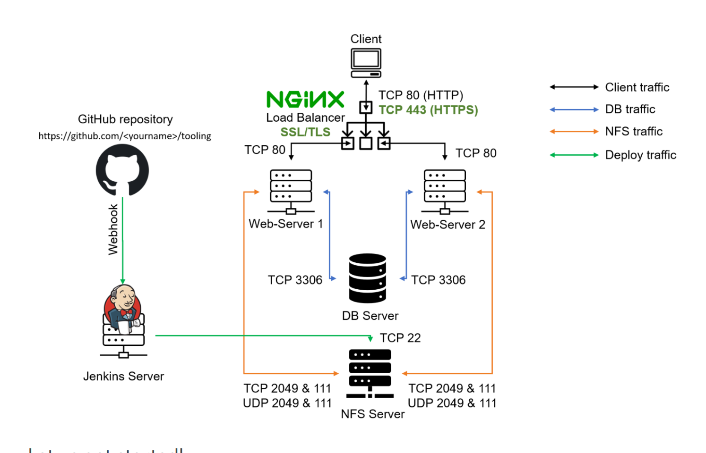

---

# ✨ Key Features

* **HTTPS using SSL/TLS** to secure communication between clients and the application.
* **NGINX load balancing** to distribute incoming client requests across multiple web servers.
* **`least_conn` / `weight` load-balancing strategy** for controlling how traffic is distributed between backend servers.
* **Two independent web servers**, which have already been created and configured.
* **Dedicated MySQL database server**, which has already been created and configured.
* **Centralized NFS shared storage**, which has already been created and configured.
* **Automated CI/CD using Jenkins**, which has already been configured.
* **GitHub webhook integration** to trigger the Jenkins deployment process when changes are pushed to the repository.

---

# Infrastructure Overview

The deployment consists of several components, with each component responsible for a specific role within the architecture.

| Component    | Role                                 | Protocol / Port |
| ------------ | ------------------------------------ | --------------- |
| Client       | Accesses the deployed application    | HTTP / HTTPS    |
| NGINX        | Reverse proxy and load balancer      | `80 / 443`      |
| Web Server 1 | Hosts the application                | `80`            |
| Web Server 2 | Hosts the application                | `80`            |
| MySQL Server | Provides persistent database storage | `3306`          |
| NFS Server   | Provides shared application storage  | `111 / 2049`    |
| Jenkins      | Automates CI/CD and deployment       | `22 / 8080`     |
| GitHub       | Hosts the application source code    | HTTPS / Webhook |

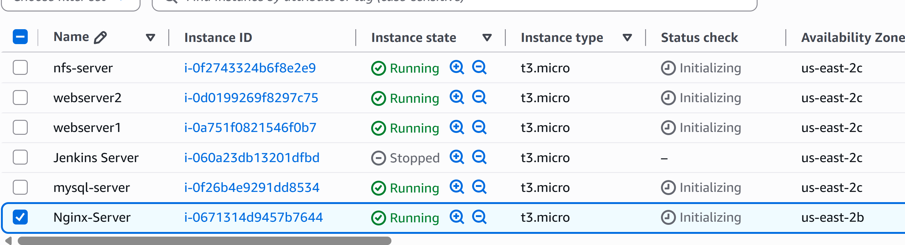

---

# Network & Security

The AWS infrastructure uses security groups to control communication between the different components.

The security-group configuration follows the principle that each server should only accept traffic from the services that require access to it.

## NGINX Load Balancer

The NGINX load balancer accepts HTTP and HTTPS traffic from clients.

The following inbound rules are required:

```text
Inbound:

TCP 80   ← 0.0.0.0/0
TCP 443  ← 0.0.0.0/0
SSH 22   ← YOUR_ADMIN_IP/32
```

* **TCP 80** allows HTTP traffic.
* **TCP 443** allows HTTPS traffic.
* **SSH 22** allows administrative access from the administrator's trusted IP address.

---

## Web Servers

The web servers receive application traffic from the NGINX load balancer.

They also require access for Jenkins deployment and communication with the NFS server.

```text
TCP 80   ← NGINX Security Group
TCP 22   ← Jenkins Security Group / Admin IP
TCP 111  ← NFS Security Group
TCP 2049 ← NFS Security Group
```

---

## Database Server

The MySQL server accepts database connections from the web servers.

```text
TCP 3306 ← Web Server Security Group
TCP 22   ← Admin/Jenkins Security Group
```

Port `3306` is used for MySQL database communication.

---

## NFS Server

The NFS server provides shared storage to both web servers.

The following ports are used for NFS communication:

```text
TCP 2049 ← Web Server Security Group
UDP 2049 ← Web Server Security Group
TCP 111  ← Web Server Security Group
UDP 111  ← Web Server Security Group
TCP 22   ← Admin/Jenkins Security Group
```

Ports `111` and `2049` are required for the NFS communication used by the architecture.

---

# AWS Deployment Guide

## 1. Create the AWS Infrastructure

The required EC2 instances have already been created as part of the previous project.

The infrastructure consists of the following servers:

```text
NGINX Load Balancer
Web Server 1
Web Server 2
Database Server
NFS Server
Jenkins Server
```

The current project focuses on configuring the **NGINX load balancer and SSL/TLS**, while the other infrastructure components have already been created and configured.

---

# Configure the NGINX Load Balancer Server

## 1. Create the NGINX Server

Create a new virtual machine using **Ubuntu Server 20.04** and name it:

```text
NGinx-server
```

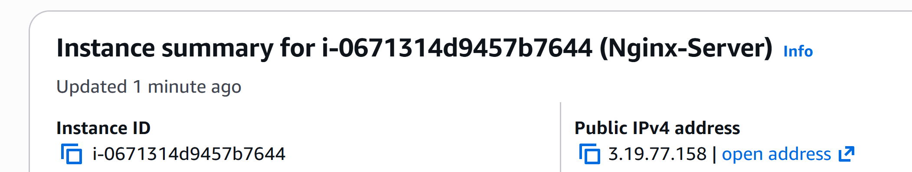

This server will act as the central entry point for client traffic. It will receive HTTP/HTTPS requests and forward them to the available backend web servers.

---

## 2. Install NGINX

Update the Ubuntu package repository:

```bash
sudo apt update
```

Install NGINX:

```bash
sudo apt install nginx -y
```

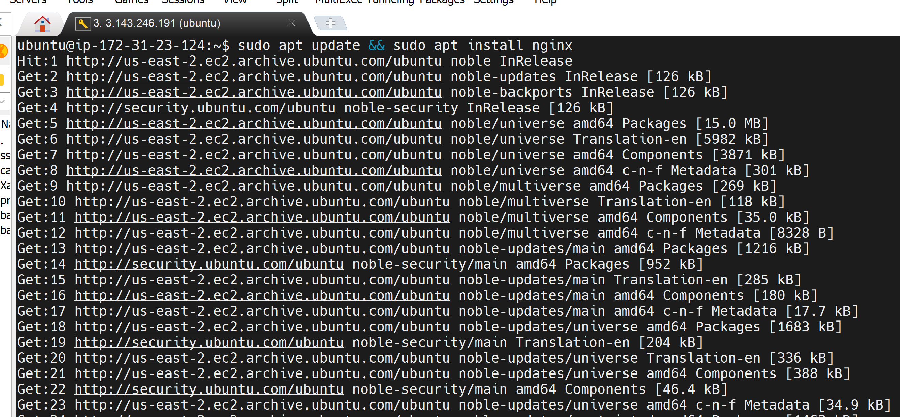

After installation, verify that NGINX is running:

```bash
sudo systemctl status nginx
```

---

# Configure NGINX

## 3. Open the NGINX Configuration File

Open the main NGINX configuration file:

```bash
sudo nano /etc/nginx/nginx.conf
```

The NGINX configuration is responsible for defining the backend servers, load-balancing method, listening ports, domain name, and proxy settings.

---

## 4. Configure the Load Balancer

The following configuration defines the NGINX load balancer:

```nginx
user www-data;
worker_processes auto;

pid /run/nginx.pid;

events {
    worker_connections 768;
}

http {

    upstream tooling {

        least_conn;

        server <WEB_SERVER_1_PRIVATE_IP>:80;
        server <WEB_SERVER_2_PRIVATE_IP>:80;
    }

    server {

        listen 80;
        server_name example.com www.example.com;

        location / {

            proxy_pass http://tooling;

            proxy_set_header Host $host;
            proxy_set_header X-Real-IP $remote_addr;
            proxy_set_header X-Forwarded-For $proxy_add_x_forwarded_for;
            proxy_set_header X-Forwarded-Proto $scheme;
        }
    }
}
```

### Configuration Explanation

The `upstream` block defines the backend web servers:

```nginx
upstream tooling {

    least_conn;

    server <WEB_SERVER_1_PRIVATE_IP>:80;
    server <WEB_SERVER_2_PRIVATE_IP>:80;
}
```

The `least_conn` directive instructs NGINX to send new requests to the backend server that currently has the fewest active connections.

The two backend servers are:

```text
Web Server 1
Web Server 2
```

Both servers listen on TCP port `80`.

The following section defines the domain that NGINX will respond to:

```nginx
server_name example.com www.example.com;
```

The `location /` block forwards incoming requests to the `tooling` upstream group:

```nginx
proxy_pass http://tooling;
```

The proxy headers preserve important information about the original client request:

```nginx
proxy_set_header Host $host;
proxy_set_header X-Real-IP $remote_addr;
proxy_set_header X-Forwarded-For $proxy_add_x_forwarded_for;
proxy_set_header X-Forwarded-Proto $scheme;
```

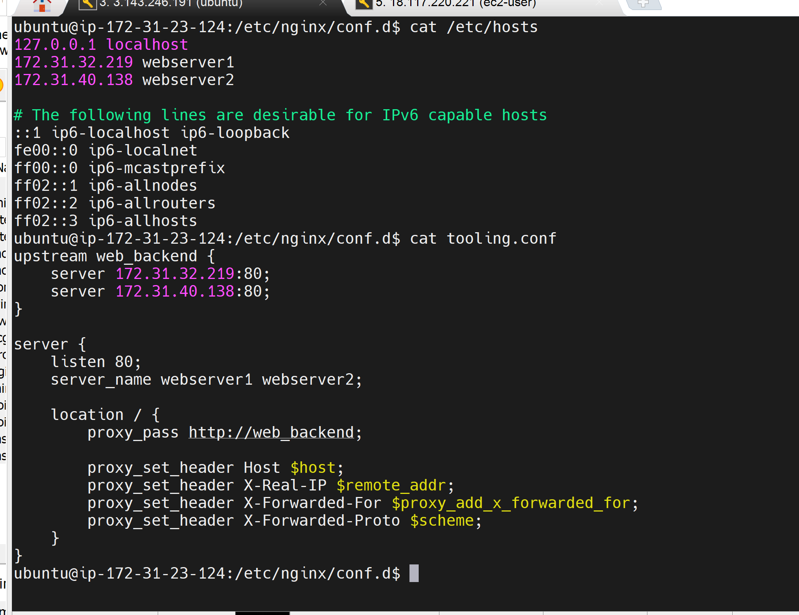

---

## 5. Test the NGINX Configuration

Before applying the configuration, verify that there are no syntax errors:

```bash
sudo nginx -t
```

If the configuration is valid, NGINX should report that the syntax is correct and the configuration test was successful.

---

## 6. Reload NGINX

Apply the configuration without stopping the NGINX service:

```bash
sudo systemctl reload nginx
```

---

## 7. Enable NGINX at Boot

Configure NGINX to start automatically whenever the server boots:

```bash
sudo systemctl enable nginx
```

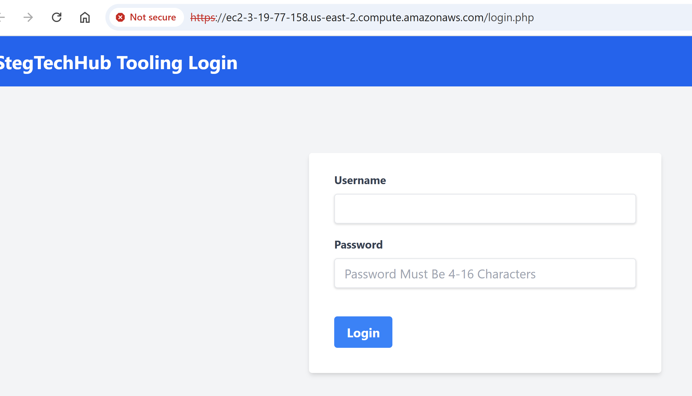

At this stage, the NGINX server is configured to receive client traffic and distribute requests to the two backend web servers.

---

# Register a New Domain and Configure SSL/TLS

## DNS Configuration

The next step is to associate the application with a domain name and configure secure HTTPS communication.

The domain was registered and configured using **Cloud DNS**.

The DNS records point the application domain to the public endpoint of the NGINX load balancer.

For this project, the application domain is:

```text
toolingwebsite.abrdns.com
```

An example DNS configuration is:

```text
A       toolingwebsite.abrdns.com        3.19.77.158
CNAME   www.toolingwebsite.abrdns.com    <target-hostname>
```

The A record associates the application domain with the public IP address of the NGINX load balancer.

The `www` hostname is configured as a CNAME pointing to the appropriate domain hostname.

---

## Verify DNS Resolution

The domain can be tested from the command line.

First, test the HTTP endpoint:

```bash
curl -I http://toolingwebsite.abrdns.com
```

You can also use `nslookup` to verify that the DNS record resolves correctly:

```bash
nslookup toolingwebsite.abrdns.com
```

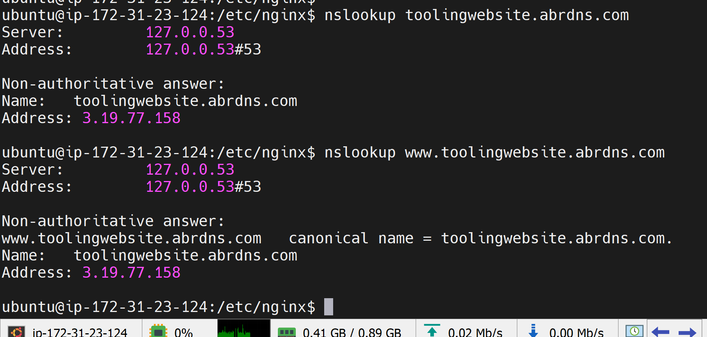

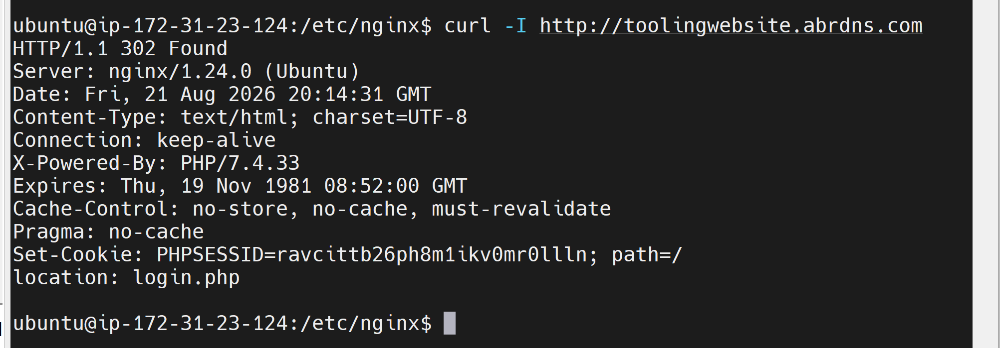

---

# HTTPS and SSL/TLS Configuration

HTTPS traffic should terminate at the NGINX load balancer.

The expected traffic flow is:

```text
Client
   │
   │ HTTPS :443
   ▼
NGINX Load Balancer
   │
   │ HTTP :80
   ▼
Web Servers
```

This means that the client establishes an encrypted HTTPS connection with NGINX. NGINX then forwards the request to the backend web servers over HTTP on port `80`.

---

# Install Certbot

For the Let's Encrypt SSL/TLS certificate, Certbot is installed on the NGINX server.

First, install `snapd`:

```bash
sudo apt install snapd -y
```

Install the Snap core package:

```bash
sudo snap install core
```

Install Certbot:

```bash
sudo snap install --classic certbot
```

Create a symbolic link so that Certbot can be executed from the standard command path:

```bash
sudo ln -s /snap/bin/certbot /usr/local/bin/certbot
```

Verify the installation:

```bash
certbot --version
```

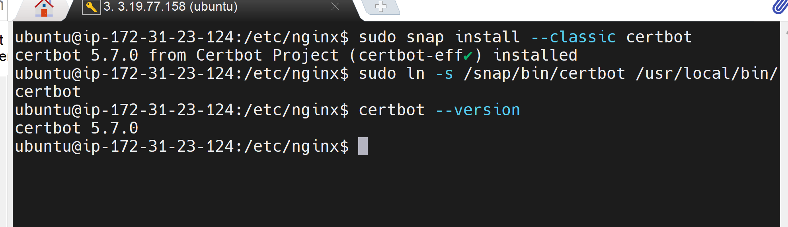

---

# Request the SSL/TLS Certificate

Request a certificate for both the main domain and the `www` hostname:

```bash
sudo certbot --nginx \
    -d toolingwebsite.abrdns.com \
    -d www.toolingwebsite.abrdns.com
```

Certbot automatically works with the NGINX configuration to obtain and configure the certificate.

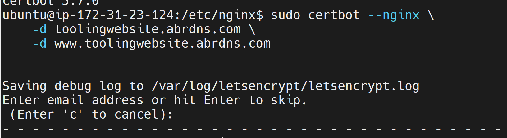

---

# Verify SSL/TLS Certificate Renewal

Let's Encrypt certificates are temporary and need to be renewed periodically.

Test the renewal process without actually renewing the certificate:

```bash
sudo certbot renew --dry-run
```

A successful dry run confirms that the renewal process is working correctly.

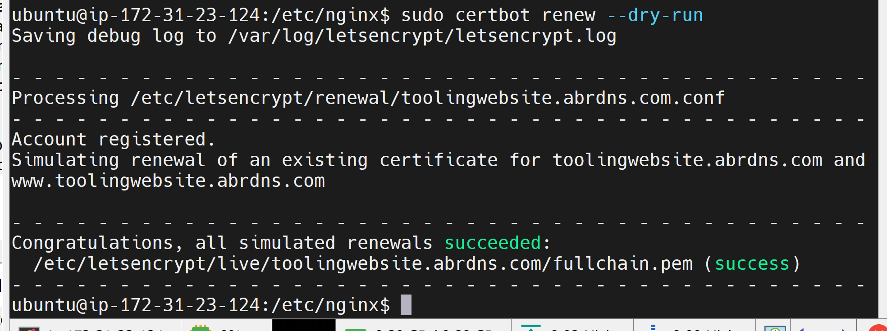

---

# Redirect HTTP Traffic to HTTPS

After TLS has been configured, HTTP traffic should be redirected to HTTPS so that users automatically access the secured version of the application.

The NGINX configuration uses the application domain:

```nginx
server_name toolingwebsite.abrdns.com www.toolingwebsite.abrdns.com;
```

The load-balancing configuration remains:

```nginx
http {

    upstream tooling {

        least_conn;

        server webserver1;
        server webserver2;
    }

    server {

        server_name toolingwebsite.abrdns.com www.toolingwebsite.abrdns.com;

        location / {

            proxy_pass http://tooling;

            proxy_set_header Host $host;
            proxy_set_header X-Real-IP $remote_addr;
            proxy_set_header X-Forwarded-For $proxy_add_x_forwarded_for;
            proxy_set_header X-Forwarded-Proto $scheme;
        }
    }
}
```

The backend servers continue to receive traffic through the `tooling` upstream group.

---

# HTTPS Server Configuration

Certbot configures the HTTPS server to listen on port `443`:

```nginx
listen 443 ssl; # managed by Certbot

ssl_certificate /etc/letsencrypt/live/toolingwebsite.abrdns.com/fullchain.pem; # managed by Certbot

ssl_certificate_key /etc/letsencrypt/live/toolingwebsite.abrdns.com/privkey.pem; # managed by Certbot

include /etc/letsencrypt/options-ssl-nginx.conf; # managed by Certbot

ssl_dhparam /etc/letsencrypt/ssl-dhparams.pem; # managed by Certbot
```

The certificate files are stored under:

```text
/etc/letsencrypt/live/toolingwebsite.abrdns.com/
```

The main certificate files are:

```text
fullchain.pem
privkey.pem
```

The `fullchain.pem` file contains the certificate chain, while `privkey.pem` contains the private key used for the TLS connection.

> **Important:** The private key must be protected and should never be committed to the GitHub repository.

---

# Test the Application with DNS and SSL/TLS

Once DNS and SSL/TLS have been configured, test the application using the domain name.

From the command line:

```bash
curl -I https://toolingwebsite.abrdns.com
```

This verifies that the application can be reached using HTTPS.

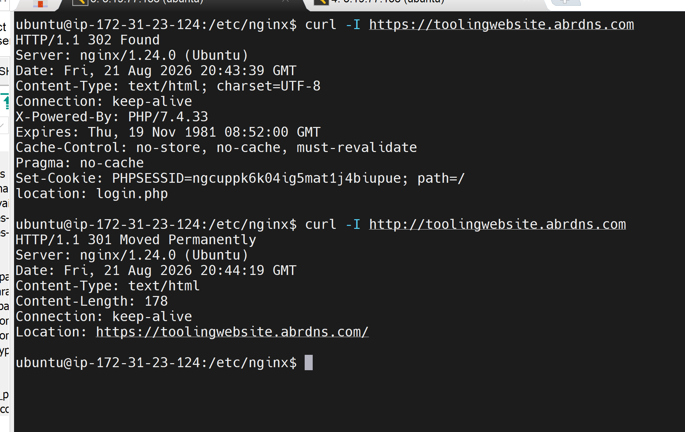

---

# Test HTTPS in the Browser

Open the following URL in a web browser:

```text
https://toolingwebsite.abrdns.com
```

The browser should display the application over HTTPS.

A padlock icon should appear in the browser address bar, indicating that the connection is secured using the configured SSL/TLS certificate.

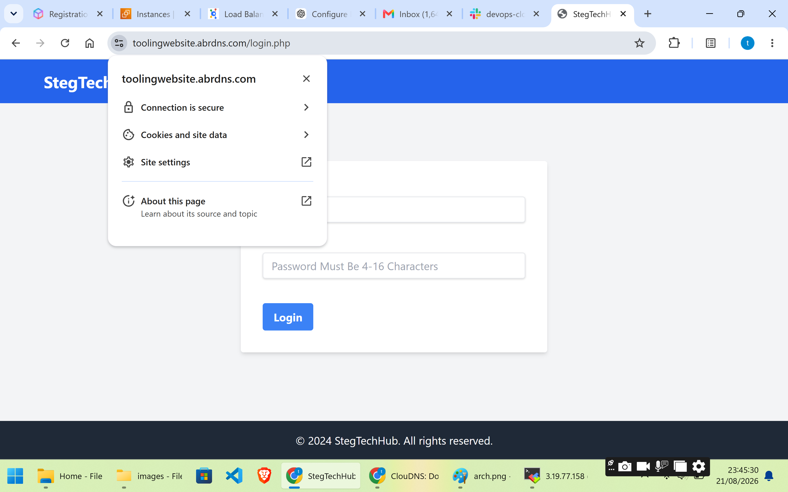

---

# Schedule SSL/TLS Certificate Renewal

To automate certificate renewal, a cron job can be configured to execute the renewal command at scheduled intervals.

Open the current user's crontab:

```bash
crontab -e
```

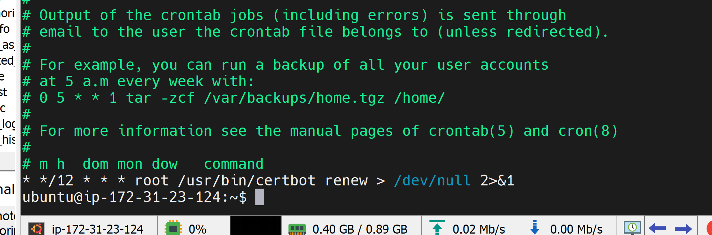

The renewal interval can be adjusted according to the requirements of the environment.

The purpose of scheduling the renewal process is to ensure that the Let's Encrypt certificate remains valid and that the HTTPS service does not become unavailable because of an expired certificate.

---

# Conclusion

The NGINX load-balancing environment is now configured to provide a secure and highly available entry point for the application.

The completed solution provides:

* **NGINX** as the central load balancer.
* **Two web servers** to handle application traffic.
* **`least_conn`** load balancing between the backend servers.
* **DNS configuration** for `toolingwebsite.abrdns.com`.
* **HTTPS** using a Let's Encrypt SSL/TLS certificate.
* **Automatic certificate renewal testing** using Certbot.
* **MySQL** as the dedicated database server.
* **NFS** as centralized shared storage.
* **Jenkins** for automated CI/CD.
* **GitHub webhooks** for triggering the deployment process.

The resulting architecture provides a structured AWS deployment where incoming client traffic is securely handled by NGINX before being distributed across the available application servers.
