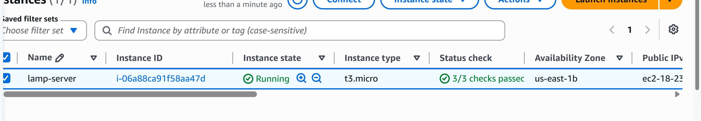
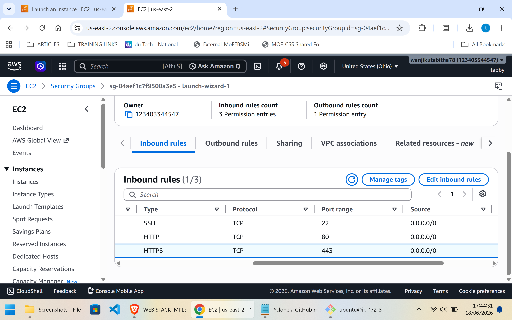
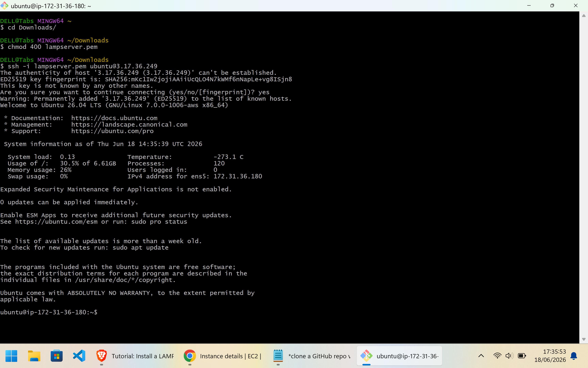
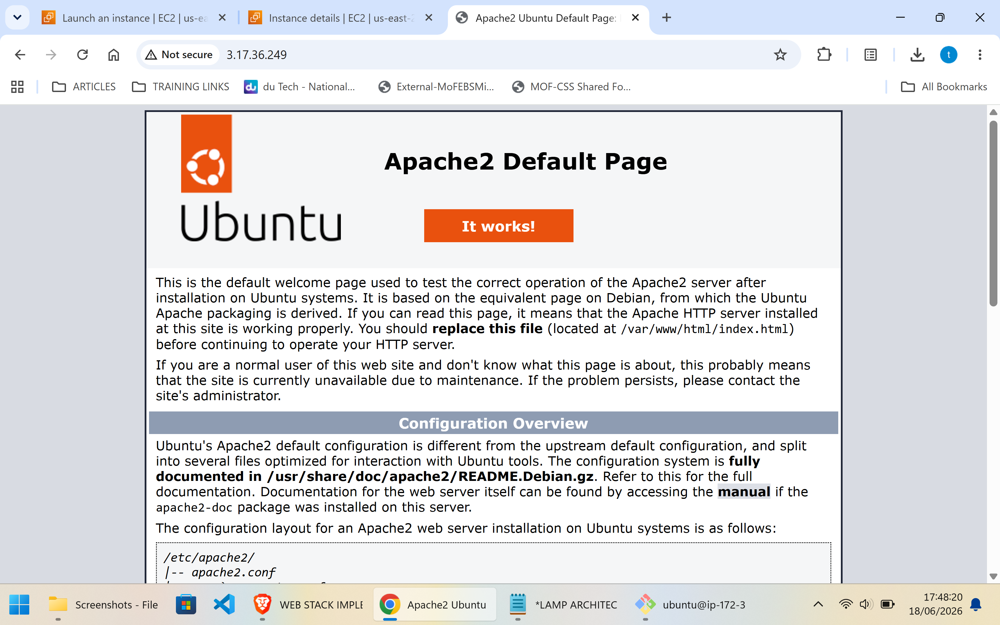
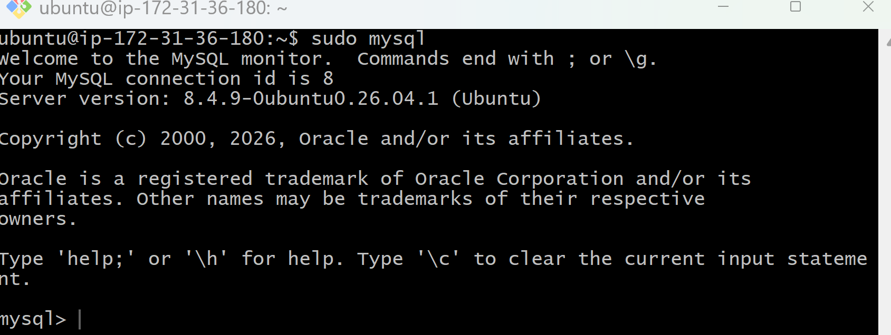
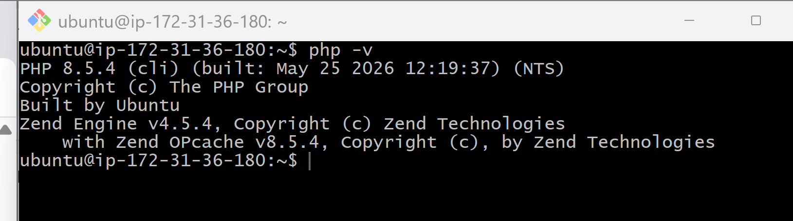
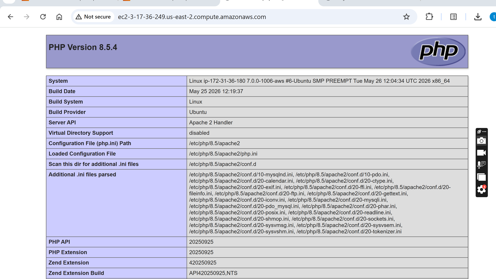
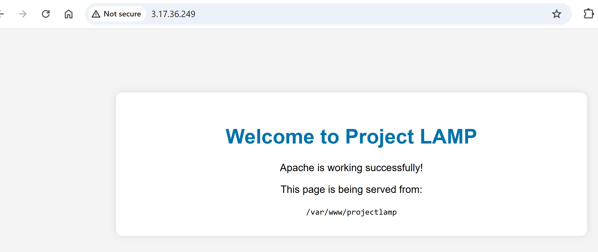

# Implementing a LAMP Stack on AWS

## Project Overview

This project demonstrates the deployment of a LAMP (Linux, Apache, MySQL, PHP) stack on an Amazon EC2 instance running Ubuntu. The objective is to provision a web server, configure the required services, and host a PHP application accessible through a web browser.

## Architecture

The solution consists of:

* Amazon EC2 instance (Ubuntu Server)
* Apache Web Server
* MySQL Database Server
* PHP Runtime Environment
* AWS Security Groups for network access

## Prerequisites

Before starting, ensure you have:

* An AWS Account
* An EC2 Key Pair
* Basic Linux command-line knowledge
* SSH client (Git Bash, Terminal, or PuTTY)

---

## Step 1: Launch an EC2 Instance

An Ubuntu EC2 instance was launched from the AWS Management Console.


### EC2 Instance Configuration

* AMI: Ubuntu Server
* Instance Type: t2.micro
* Storage: 8 GB
* Security Group Rules:
  * SSH (22)
  * HTTP (80)



---

## Step 2: Connect to the Instance

SSH into the server:

```bash
ssh -i lampkey.pem ubuntu@<public-ip-address>
```


---

## Step 3: Install Apache Web Server

Update package repositories:

```bash
sudo apt update
```

Install Apache:

```bash
sudo apt install apache2 -y
```

Start and enable the service:

```bash
sudo systemctl enable apache2
sudo systemctl start apache2
```

Verify Apache status:

```bash
sudo systemctl status apache2
```



---

## Step 4: Install MySQL

Install MySQL Server:

```bash
sudo apt install mysql-server -y
```

Secure the installation:

```bash
sudo mysql_secure_installation
```

Verify MySQL service:

```bash
sudo systemctl status mysql
```



---

## Step 5: Install PHP

Install PHP and required modules:

```bash
sudo apt install php libapache2-mod-php php-mysql -y
```

Verify PHP installation:

```bash
php -v
```


---

## Step 6: Create a Virtual Host

Create project directory:

```bash
sudo mkdir -p /var/www/projectlamp
```

Assign ownership:

```bash
sudo chown -R $USER:$USER /var/www/projectlamp
```

Create Apache virtual host configuration:

```bash
sudo nano /etc/apache2/sites-available/projectlamp.conf
```
```bash
<VirtualHost *:80>
    ServerAdmin webmaster@localhost
    DocumentRoot /var/www/lamp_project
    ErrorLog ${APACHE_LOG_DIR}/error.log
    CustomLog ${APACHE_LOG_DIR}/access.log combined
</VirtualHost>
```
Enable the site:

```bash
sudo a2ensite projectlamp
sudo a2dissite 000-default
sudo systemctl reload apache2
```

---

## Step 7: Test PHP Processing

Create a PHP info page:

```bash
nano /var/www/projectlamp/index.php
```

Add:

```php
<?php
phpinfo();
?>
```

Access:

```text
http://<public-ip-address>
```



---

## Step 8: Deploy Sample Application

A sample PHP application was deployed to verify end-to-end functionality of the LAMP stack.

### Application Output



---

## Validation

The following components were successfully configured:

* Ubuntu Linux Server
* Apache Web Server
* MySQL Database Server
* PHP Runtime
* Apache Virtual Host
* Sample PHP Application

---

## Lessons Learned

Through this project, I gained hands-on experience with:

* AWS EC2 provisioning
* Linux server administration
* Apache web server configuration
* MySQL database installation and management
* PHP application deployment
* Troubleshooting web server issues

---

