# Barista Cafe - LEMP Stack Deployment on AWS

## Project Overview

This project demonstrates the deployment of the **Barista Cafe** website on an **AWS EC2 Ubuntu instance** using a **LEMP Stack** (Linux, Nginx, MySQL, PHP).

The original Barista Cafe template is a static HTML website downloaded from Tooplate. It was enhanced by integrating PHP and MySQL to create a functional table reservation system that stores customer reservations in a MySQL database.

---

# Project Architecture

```
                Internet
                    │
                    ▼
            AWS Security Group
             (Ports 22,80,443)
                    │
                    ▼
          Ubuntu EC2 Instance
                    │
     ┌──────────────┼──────────────┐
     │              │              │
     ▼              ▼              ▼
  Nginx         PHP-FPM         MySQL
     │              │              │
     └──────► Reservation Form ◄──┘
                    │
                    ▼
             reservations Table
```

---

# Technologies Used

* AWS EC2
* Ubuntu 24.04 LTS
* Nginx
* PHP
* PHP-FPM
* MySQL
* HTML5
* CSS3
* JavaScript
* Bootstrap

---

# Project Objectives

* Deploy a LEMP stack on AWS.
* Configure Nginx to serve a website.
* Install and configure PHP-FPM.
* Install and configure MySQL.
* Connect a PHP application to MySQL.
* Store customer reservations in a database.
* Display reservations through an admin dashboard.

---

# AWS Infrastructure

| Resource         | Value   |
| ---------------- | ------- |
| Cloud Provider   | AWS     |
| Compute          | EC2     |
| Operating System | Ubuntu  |
| Web Server       | Nginx   |
| Database         | MySQL   |
| PHP Engine       | PHP-FPM |

---

# Security Group Configuration

| Protocol | Port | Purpose        |
| -------- | ---- | -------------- |
| SSH      | 22   | Remote Login   |
| HTTP     | 80   | Website Access |
| HTTPS    | 443  | Secure Website |

---

# Step 1 - Launch Ubuntu EC2 Instance

Launch an Ubuntu EC2 instance and configure the security group to allow SSH, HTTP and HTTPS traffic.

### Screenshot


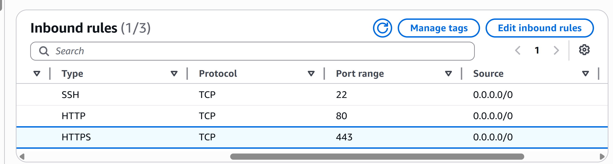


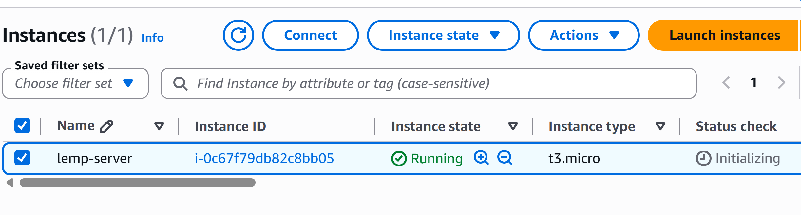


---

# Step 2 - Connect to the Server

```bash
ssh -i aws-key.pem ubuntu@<EC2-Public-IP>
```

### Screenshot

```

```


---

# Step 3 - Update Ubuntu

```bash
sudo apt update
sudo apt upgrade -y
```

---

# Step 4 - Install Nginx

```bash
sudo apt install nginx -y

sudo systemctl enable nginx

sudo systemctl start nginx
```

Verify:

```bash
sudo systemctl status nginx
```

### Screenshot


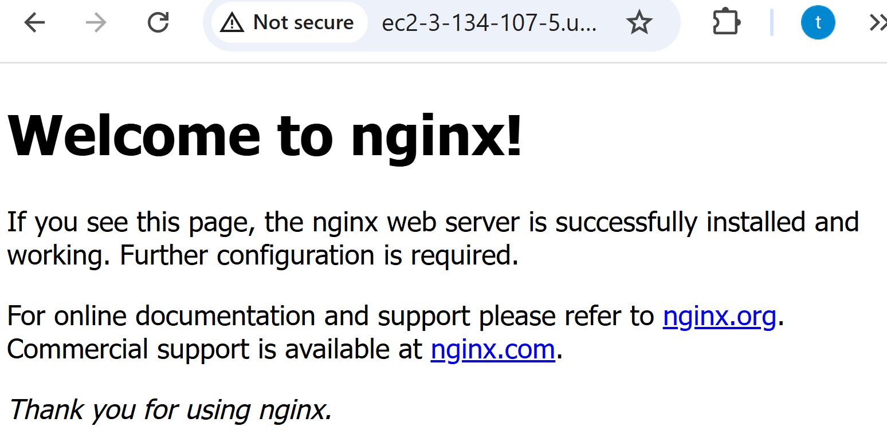


---

# Step 5 - Install MySQL

```bash
sudo apt install mysql-server -y
```

Secure MySQL:

```bash
sudo mysql_secure_installation
```

Verify:

```bash
sudo systemctl status mysql
```

### Screenshot


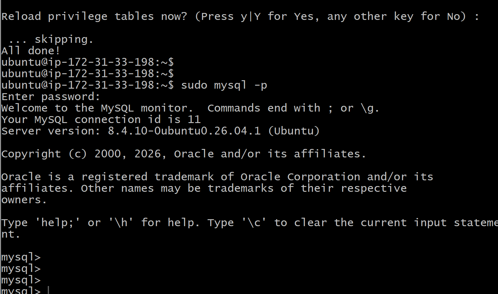


---

# Step 6 - Install PHP

```bash
sudo apt install php-fpm php-mysql php-cli php-curl php-mbstring php-xml php-zip -y
```

Verify:

```bash
php -v
```

### Screenshot


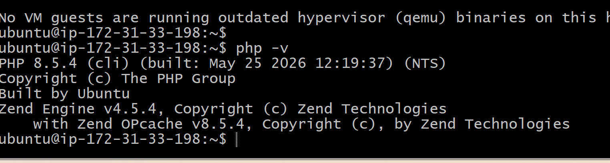


---

# Step 7 - Configure Nginx

Create the server block.

```bash
sudo nano /etc/nginx/sites-available/projectlemp
```

Enable the site.

```bash
sudo ln -s /etc/nginx/sites-available/projectlemp /etc/nginx/sites-enabled/
```

Test configuration.

```bash
sudo nginx -t
```

Restart Nginx.

```bash
sudo systemctl restart nginx
```

### Screenshot


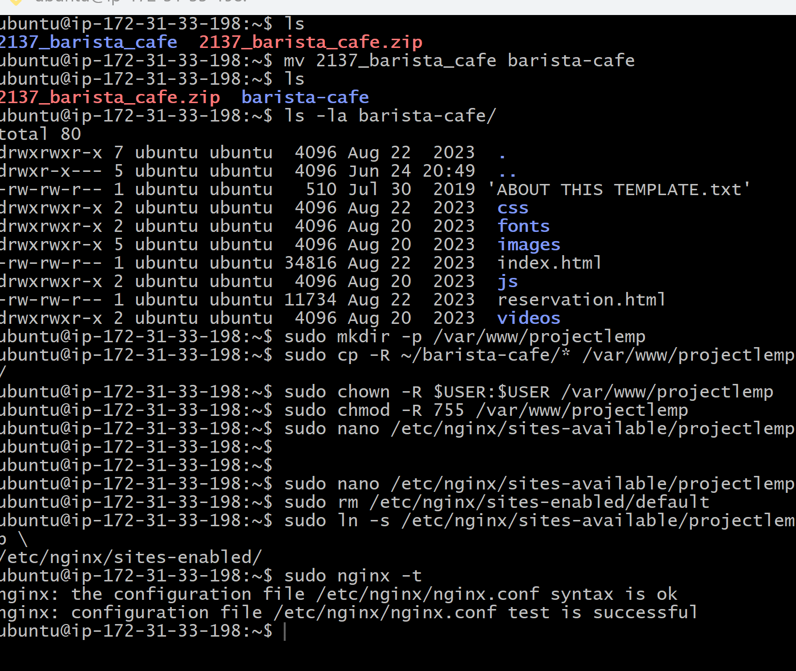```

---

# Step 8 - Deploy the Website

Copy the extracted website files into the web root.

```bash
sudo cp -R ~/barista-cafe/* /var/www/projectlemp/
```

Set permissions.

```bash
sudo chown -R www-data:www-data /var/www/projectlemp

sudo chmod -R 755 /var/www/projectlemp
```

### Screenshot


---

# Step 9 - Create MySQL Database

Login.

```bash
sudo mysql
```

Create database.

```sql
CREATE DATABASE barista_cafe;
```

Create user.

```sql
CREATE USER 'baristauser'@'localhost'
IDENTIFIED BY 'Pass88888!';
```

Grant permissions.

```sql
GRANT ALL PRIVILEGES
ON barista_cafe.*
TO 'baristauser'@'localhost';

FLUSH PRIVILEGES;
```

### Screenshot


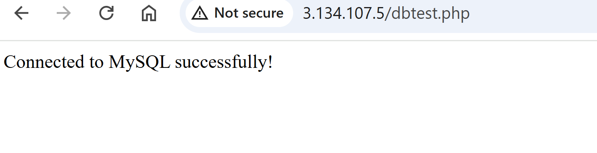


---

# Step 10 - Create Reservations Table

```sql
USE barista_cafe;

CREATE TABLE reservations (

id INT AUTO_INCREMENT PRIMARY KEY,

fullname VARCHAR(100),

phone VARCHAR(20),

reservation_time TIME,

reservation_date DATE,

number_of_people INT,

comment TEXT,

created_at TIMESTAMP DEFAULT CURRENT_TIMESTAMP

);
```

Verify.

```sql
SHOW TABLES;

DESCRIBE reservations;
```

### Screenshot


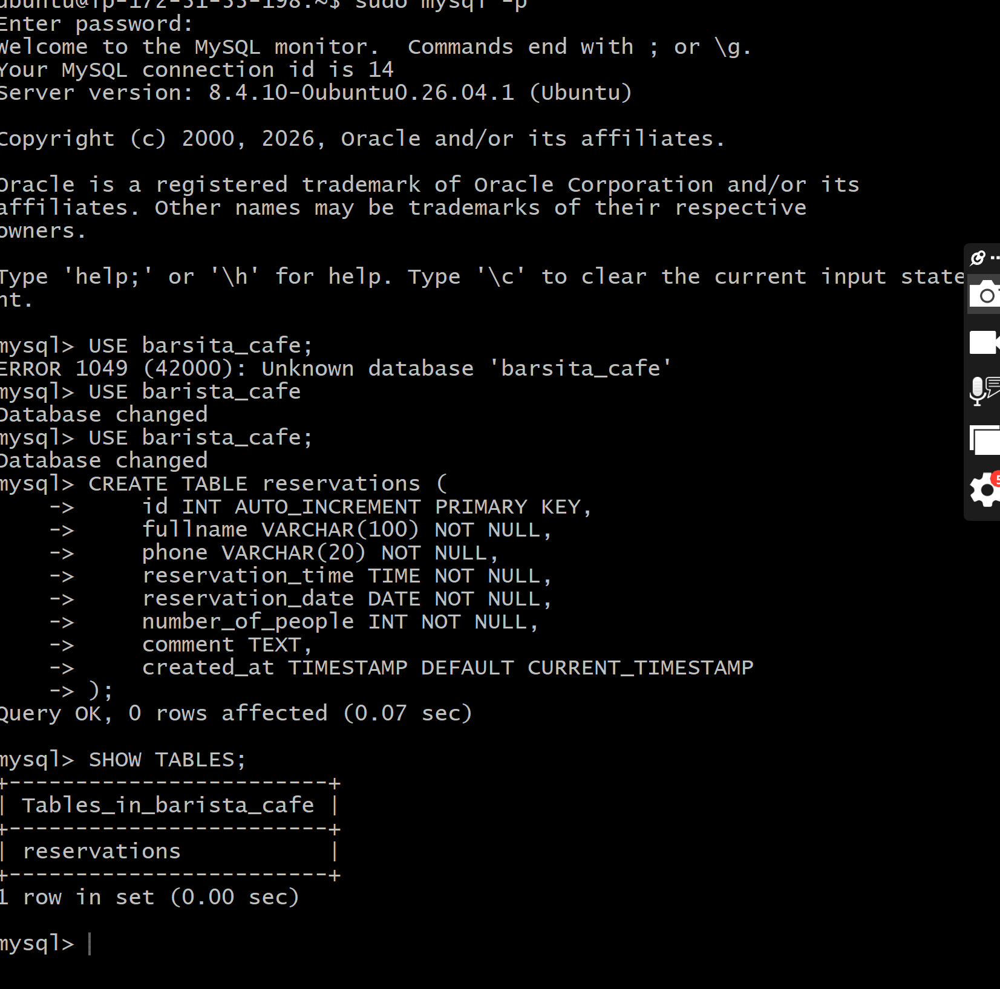


---

# Step 11 - PHP Reservation System

Created a PHP backend (`reservation.php`) to:

* Receive form data
* Connect to MySQL
* Validate user input
* Insert reservation into the database
* Display a success message

### Screenshot


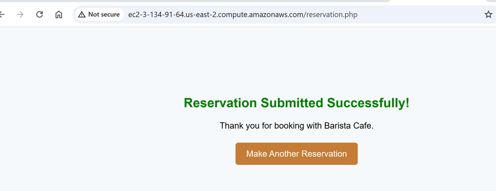


---

# Step 12 - Verify Database Records

```sql
SELECT * FROM reservations;
```

### Screenshot


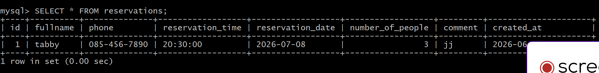


---

# Step 13 - Admin Dashboard

Created an `admin.php` page to display all reservations stored in MySQL.

### Screenshot


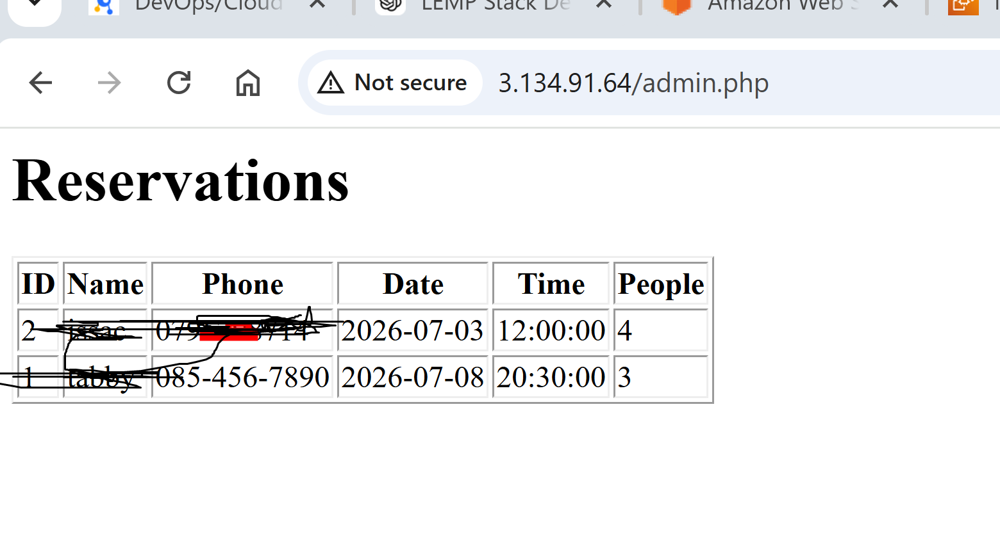


---

# Final Website

### Home Page


### Reservation Form


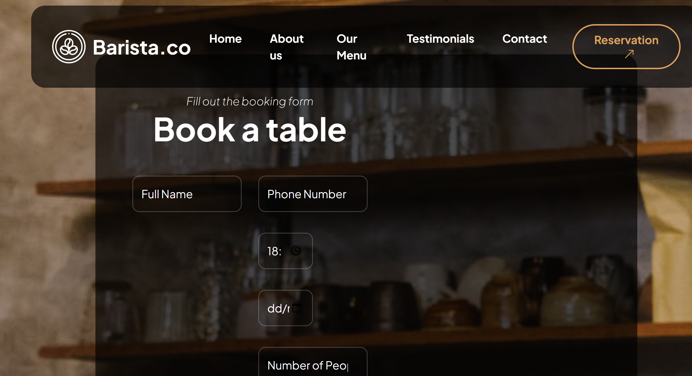


### Successful Reservation


### Admin Dashboard


---

# Project Directory Structure

```
projectlemp/

│── css/

│── fonts/

│── images/

│── js/

│── videos/

│── index.html

│── reservation.html

│── reservation.php

│── admin.php
```

---

# Commands Used

## Ubuntu

```bash
sudo apt update
sudo apt upgrade
sudo apt install nginx
sudo apt install mysql-server
sudo apt install php-fpm php-mysql
sudo systemctl restart nginx
sudo systemctl restart mysql
sudo nginx -t
```

## MySQL

```sql
SHOW DATABASES;

USE barista_cafe;

SHOW TABLES;

SELECT * FROM reservations;

DESCRIBE reservations;
```

---

# Lessons Learned

* Deploying a LEMP stack on AWS EC2
* Configuring Nginx server blocks
* Installing and configuring PHP-FPM
* Installing and securing MySQL
* Connecting PHP to MySQL
* Processing HTML forms with PHP
* Storing application data in a MySQL database
* Creating a simple admin dashboard
* Managing Linux file permissions
* Deploying a full-stack web application

---
