# MEAN Stack Deployment on AWS EC2

This guide walks through deploying a MEAN (MongoDB, Express, Angular, Node.js) stack application on an AWS EC2 instance, from provisioning the server to accessing the running app via its public DNS.

## Table of Contents

 [1. Launch an EC2 Instance](#1-launch-an-ec2-instance)
 [2. Connect to the Server](#2-connect-to-the-server)
 [3. Update the Server](#3-update-the-server)
 [4. Add SSL Certificates](#4-add-ssl-certificates)
 [5. Install Node.js](#5-install-nodejs)
 [6. Install MongoDB](#6-install-mongodb)
 [7. Set Up the Project](#7-set-up-the-project)
 [8. Build the Express Server](#8-build-the-express-server)
 [9. Create Routes](#9-create-routes)
 [10. Create the Model](#10-create-the-model)
 [11. Build the AngularJS Frontend](#11-build-the-angularjs-frontend)
 [12. Run and Test the Application](#12-run-and-test-the-application)
 [13. Open the Port and Access the App](#13-open-the-port-and-access-the-app)

---

## 1. Launch an EC2 Instance

Launch an EC2 instance from the AWS Management Console.

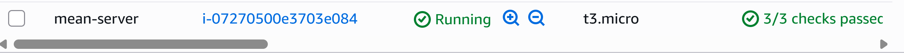

## 2. Connect to the Server

SSH into the server as the `ubuntu` user.

```bash
ssh -i "your-key.pem" ubuntu@<your-ec2-public-ip>
```

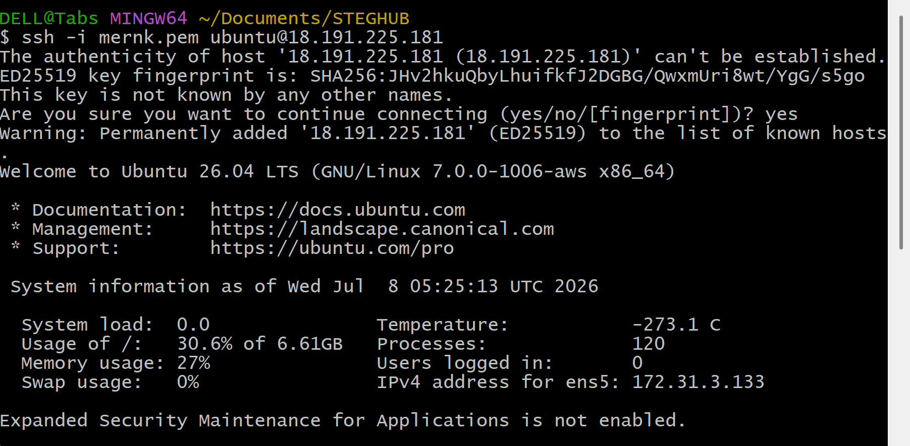

## 3. Update the Server

Update and upgrade the server packages.

```bash
sudo apt update && sudo apt upgrade -y
```

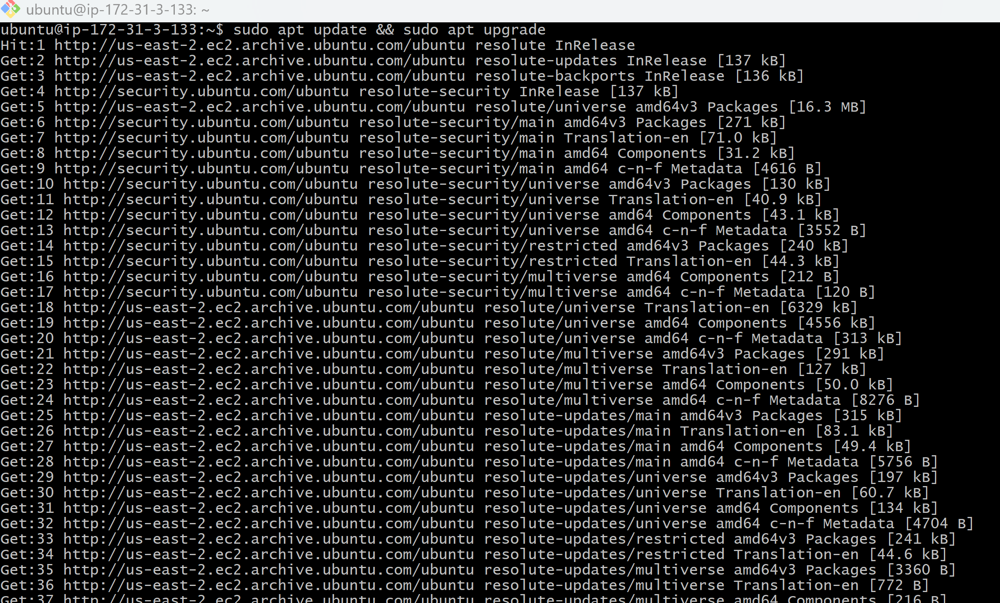

## 4. Add SSL Certificates

Add the required certificates to the server.

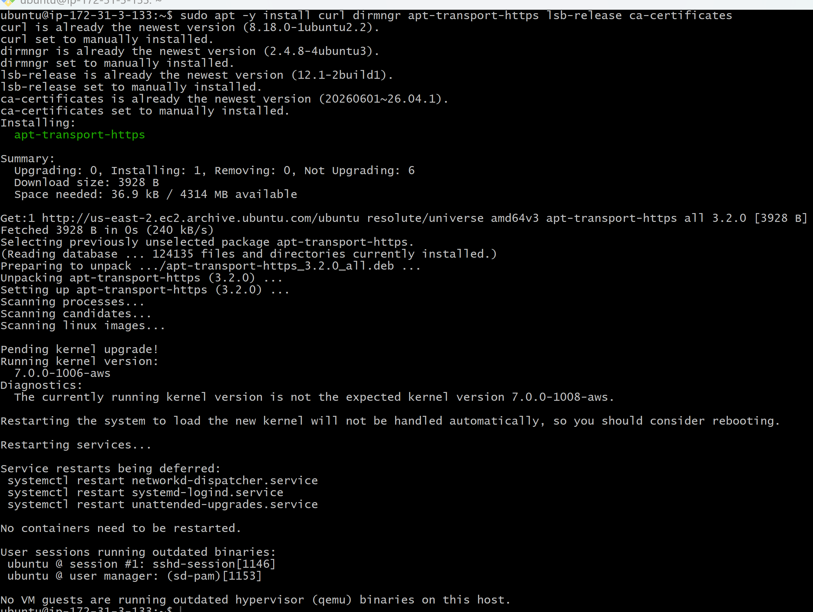
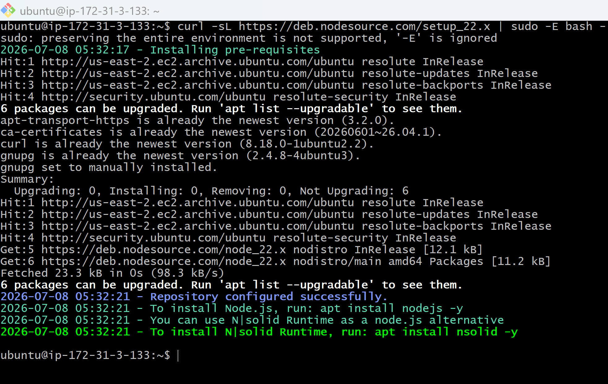

## 5. Install Node.js

Install Node.js on the server.

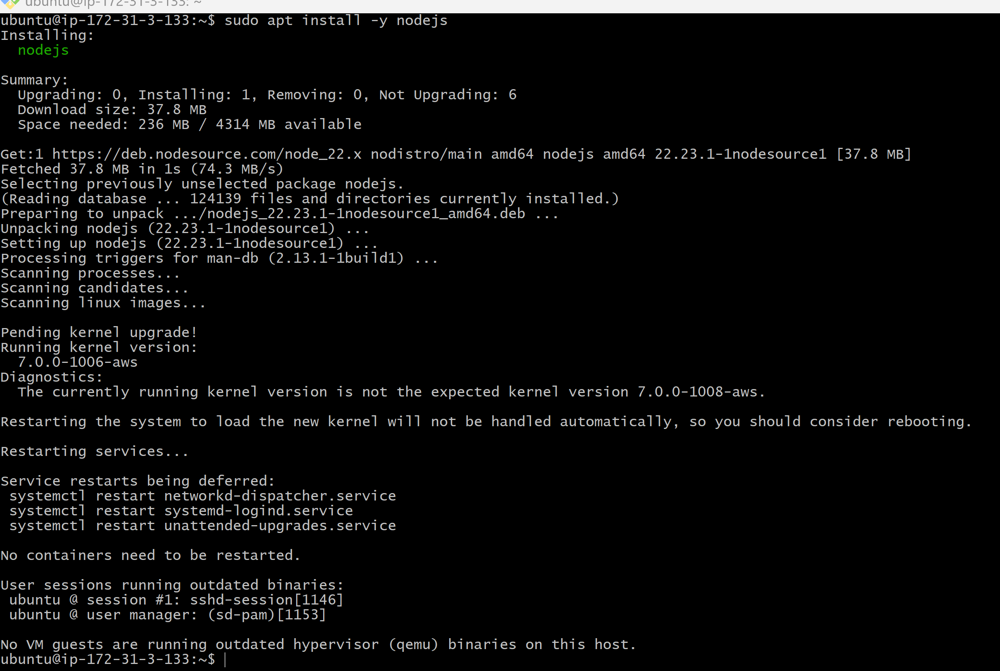
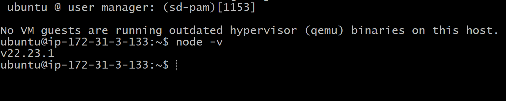

## 6. Install MongoDB

### Install curl and gnupg

```bash
sudo apt install -y curl gnupg
```

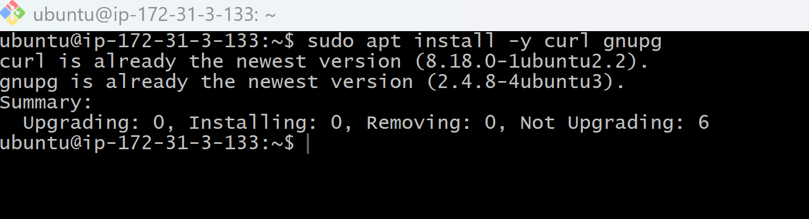

### Download the MongoDB GPG Key

```bash
curl -fsSL https://www.mongodb.org/static/pgp/server-7.0.asc | \
  sudo gpg -o /usr/share/keyrings/mongodb-server-7.0.gpg --dearmor
```

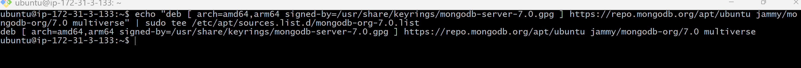
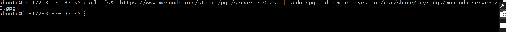

### Install MongoDB

```bash
sudo apt update
sudo apt install -y mongodb-org
sudo systemctl start mongod
sudo systemctl enable mongod
```

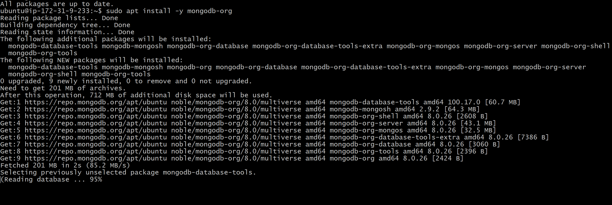
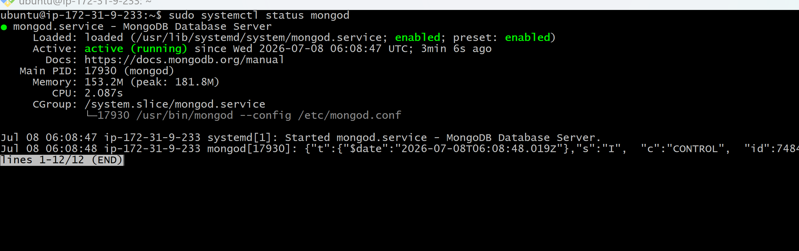

###  Install npm

```bash
sudo apt install -y npm
```

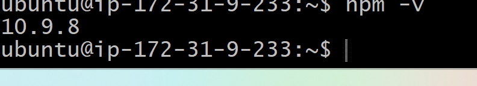

###  Install the Body-Parser Package

```bash
npm install body-parser
```

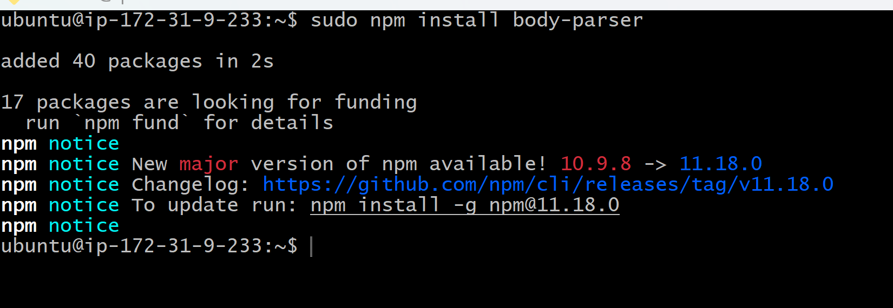

## 7. Set Up the Project

Create a directory called `Books` and move into it.

```bash
mkdir Books && cd Books
```
Initialize a new npm project.

```bash
npm init -y
```
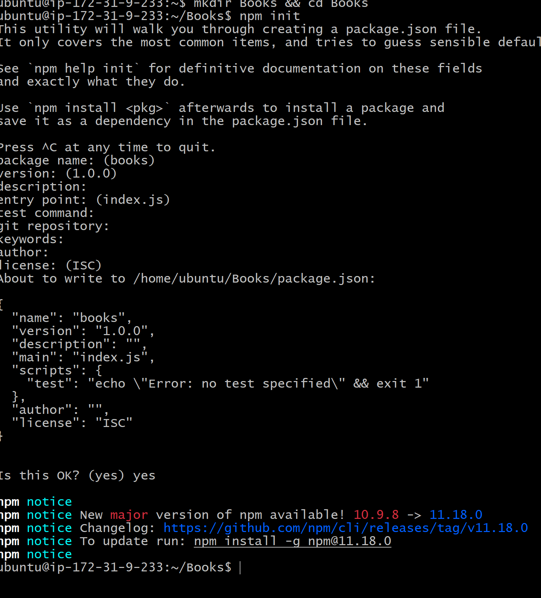

## 8. Build the Express Server

Inside the `Books` directory, create a file called `server.js`.

```bash
touch server.js
```

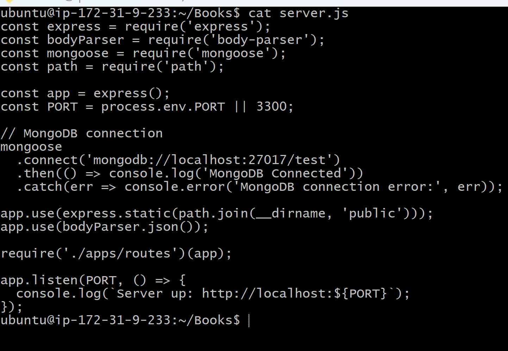

```js
// server.js
const express = require('express');
const bodyParser = require('body-parser');
const mongoose = require('mongoose');
const path = require('path');

const app = express();
const PORT = process.env.PORT || 3300;

// MongoDB connection
mongoose
  .connect('mongodb://localhost:27017/test')
  .then(() => console.log('MongoDB Connected'))
  .catch(err => console.error('MongoDB connection error:', err));

app.use(express.static(path.join(__dirname, 'public')));
app.use(bodyParser.json());

require('./apps/routes')(app);

app.listen(PORT, () => {
  console.log(`Server up: http://localhost:${PORT}`);
});

```

## Install Express and set up the base server routes.

```bash
npm install express
```

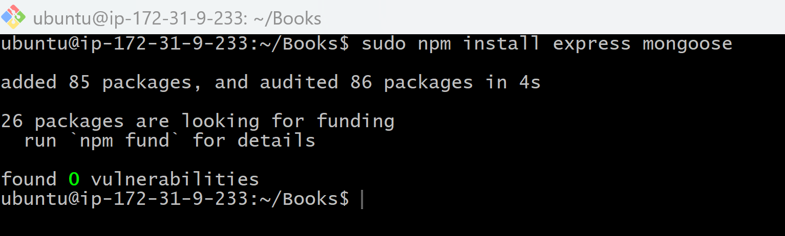

## 9. Create Routes

Create an `apps` directory and move into it.

```bash
mkdir apps && cd apps
```

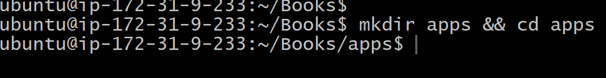

Inside `apps`, create a file called `routes.js`.

```bash
touch routes.js
```

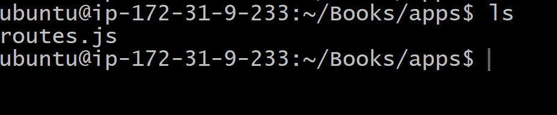

```js
// apps/routes.js
const Book = require('./models/book');
const path = require('path');

module.exports = function (app) {

    // GET all books
    app.get('/book', async (req, res) => {
        try {
            const books = await Book.find();
            res.json(books);
        } catch (err) {
            res.status(500).json({
                message: 'Error fetching books',
                error: err.message
            });
        }
    });

    // POST a new book
    app.post('/book', async (req, res) => {
        try {
            const book = new Book({
                name: req.body.name,
                isbn: req.body.isbn,
                author: req.body.author,
                pages: req.body.pages
            });

            const savedBook = await book.save();

            res.status(201).json({
                message: 'Successfully added book',
                book: savedBook
            });

        } catch (err) {
            res.status(400).json({
                message: 'Error adding book',
                error: err.message
            });
        }
    });

    // DELETE a book by ISBN
    app.delete('/book/:isbn', async (req, res) => {
        try {
            const result = await Book.findOneAndDelete({
                isbn: req.params.isbn
            });

            if (!result) {
                return res.status(404).json({
                    message: 'Book not found'
                });
            }

            res.json({
                message: 'Successfully deleted the book',
                book: result
            });

        } catch (err) {
            res.status(500).json({
                message: 'Error deleting book',
                error: err.message
            });
        }
    });


```

## 10. Create the Model folder

Inside the `apps` folder, create a folder called `models` and move into it.

```bash
mkdir models && cd models
```

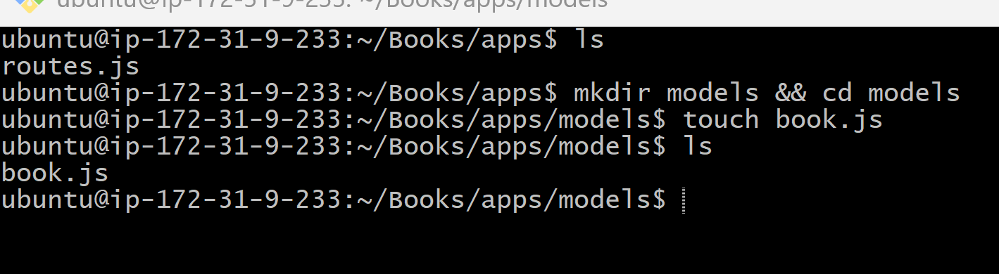

Inside the `models` folder, create a file called `book.js`.

```bash
touch book.js
```

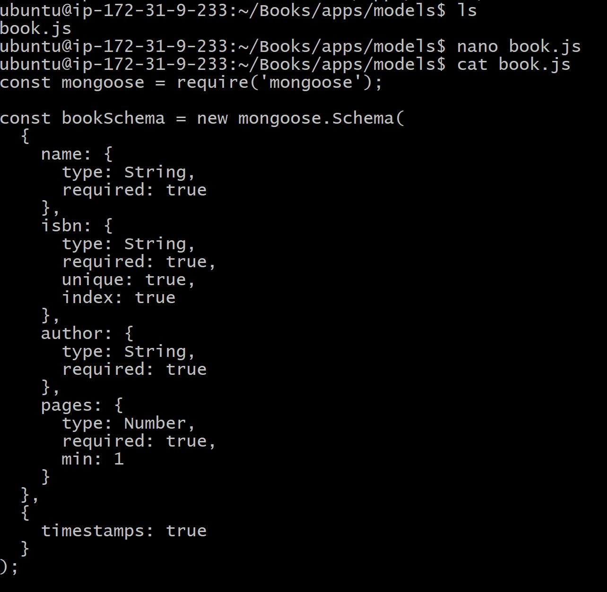

```js
// apps/models/book.js
const mongoose = require('mongoose');

const bookSchema = new mongoose.Schema(
  {
    name: {
      type: String,
      required: true
    },
    isbn: {
      type: String,
      required: true,
      unique: true,
      index: true
    },
    author: {
      type: String,
      required: true
    },
    pages: {
      type: Number,
      required: true,
      min: 1
    }
  },
  {
    timestamps: true
  }
);

module.exports = mongoose.model('Book', bookSchema);
```

## 11. Build the AngularJS Frontend

Navigate back to the `Books` folder, create a folder called `public`, and move into it.

```bash
cd ../.. Books
mkdir public && cd public
```

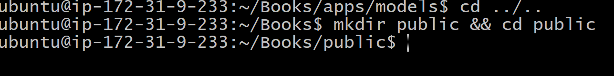

Inside the `public` folder, create a file called `script.js`.

```bash
touch script.js
```

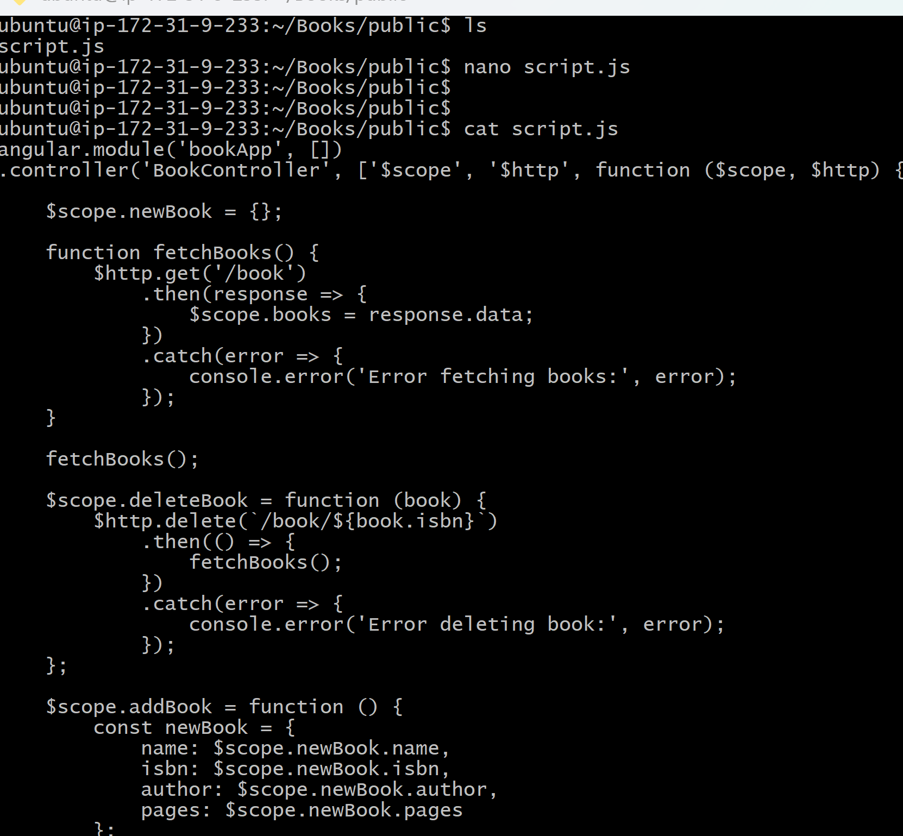

```js
// public/script.js
angular.module('bookApp', [])
.controller('BookController', ['$scope', '$http', function ($scope, $http) {

    $scope.newBook = {};

    function fetchBooks() {
        $http.get('/book')
            .then(response => {
                $scope.books = response.data;
            })
            .catch(error => {
                console.error('Error fetching books:', error);
            });
    }

    fetchBooks();

    $scope.deleteBook = function (book) {
        $http.delete(`/book/${book.isbn}`)
            .then(() => {
                fetchBooks();
            })
            .catch(error => {
                console.error('Error deleting book:', error);
            });
    };

    $scope.addBook = function () {
        const newBook = {
            name: $scope.newBook.name,
            isbn: $scope.newBook.isbn,
            author: $scope.newBook.author,
            pages: $scope.newBook.pages
        };

        $http.post('/book', newBook)
            .then(() => {
                fetchBooks();

                // Clear the form
                $scope.newBook = {};
            })
            .catch(error => {
                console.error('Error adding book:', error);
            });
    };

}]);

```

## Create another file in the `public` folder called `index.html`.

```bash
touch index.html
```

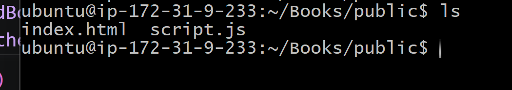

```html
<!-- public/index.html -->
<!DOCTYPE html>
<html lang="en" ng-app="bookApp">

<head>
    <meta charset="UTF-8">
    <meta name="viewport" content="width=device-width, initial-scale=1.0">
    <title>Book Management</title>

    <script src="https://ajax.googleapis.com/ajax/libs/angularjs/1.8.2/angular.min.js"></script>
    <script src="script.js"></script>

    <style>
        body {
            font-family: Arial, sans-serif;
            margin: 20px;
        }

        table {
            width: 100%;
            border-collapse: collapse;
            margin-bottom: 20px;
        }

        th,
        td {
            border: 1px solid #ddd;
            padding: 8px;
            text-align: left;
        }

        th {
            background-color: #f2f2f2;
        }

        input[type="text"],
        input[type="number"] {
            width: 100%;
            padding: 6px;
            box-sizing: border-box;
        }

        button {
            padding: 8px 12px;
            cursor: pointer;
        }
    </style>
</head>

```

## 12. Run and Test the Application

Go back to the `Books` folder and run the server.

```bash
cd ../Books
node server.js
```

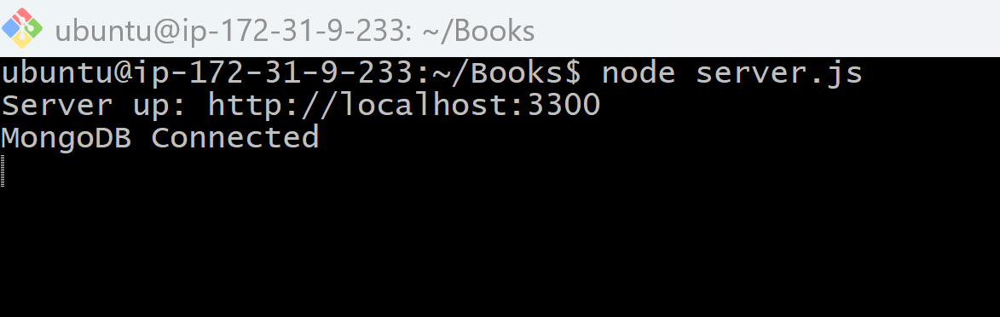

Open a local terminal and test with `curl`.

```bash
curl http://localhost:3300
```

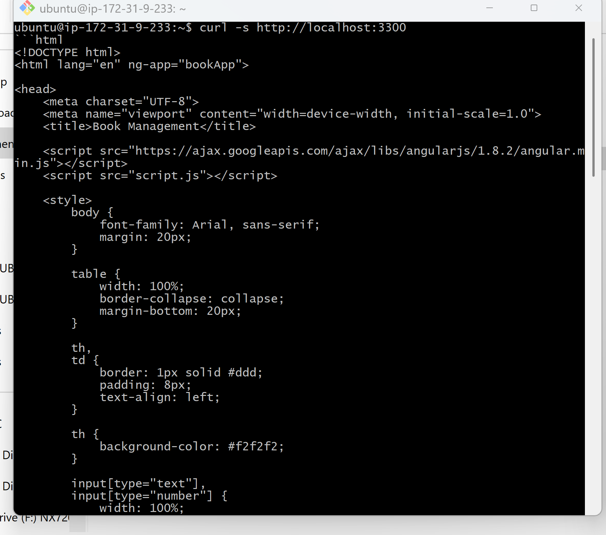

## 13. Open the Port and Access the App

Open port `3300` on the EC2 instance's security group.

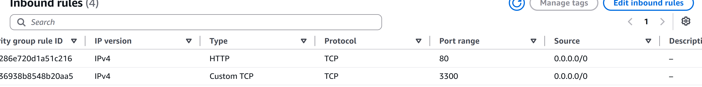

Navigate to the public DNS of the instance in your browser. You should see the running application.

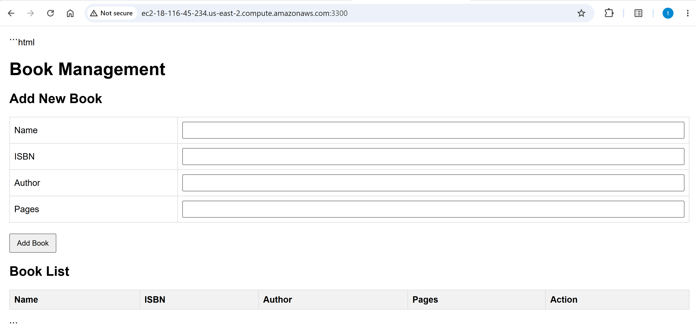
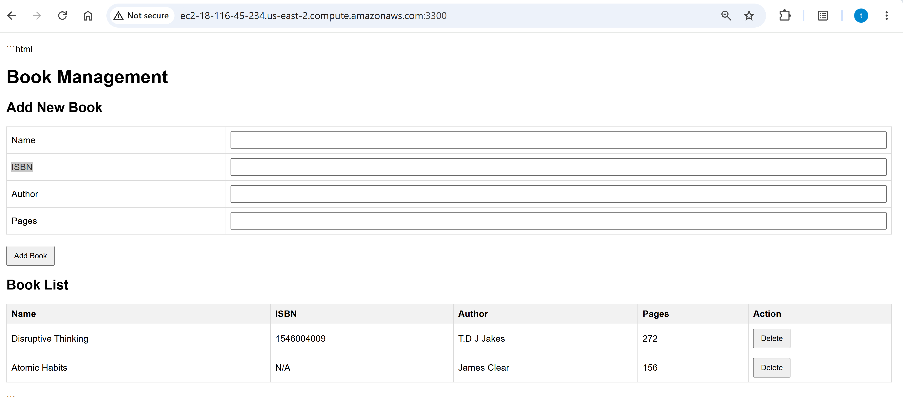
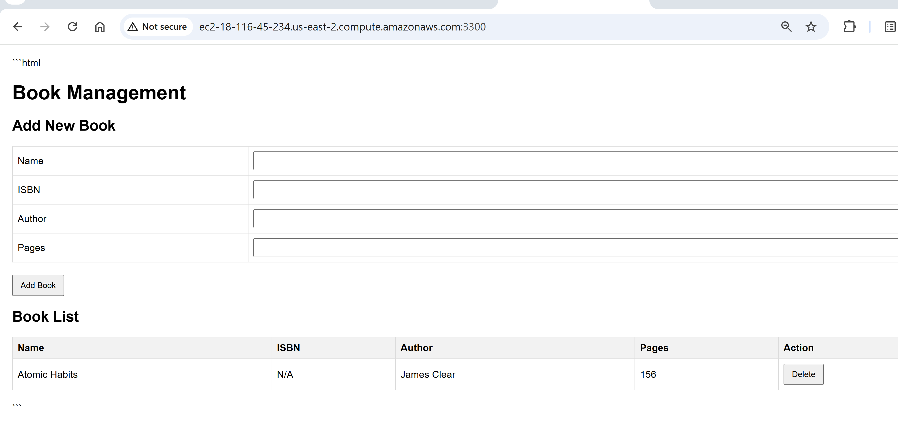

---
## Lessons Learned

### Key Skills Acquired

By completing this project, I gained experience in:

- Full-stack web application development
- REST API development
- MongoDB database design
- Express.js backend development
- AngularJS frontend development
- Node.js server management
- Linux system administration
- AWS EC2 deployment
- Git and GitHub workflows
- Application debugging and troubleshooting
- Technical documentation using Markdown

---

## Conclusion

This project strengthened my understanding of the complete MEAN Stack development lifecycle, from environment setup and backend development to frontend integration, database management, deployment on AWS, and application troubleshooting. It also reinforced best practices for writing maintainable code, debugging effectively, and documenting software projects.

