# Client-Server Architecture with MySQL Using Two EC2 Instances

## Project Overview

This project demonstrates how to implement a simple **Client-Server Architecture** using **MySQL** on two separate **AWS EC2 Ubuntu instances**.

The objective is to configure one EC2 instance as a **MySQL Server** and another as a **MySQL Client**, allowing the client to connect securely to the database server over a private network without using SSH.

---

## Architecture

```text
                    AWS Cloud
+----------------------------------------------------+

      +---------------------+
      |   MySQL Client EC2  |
      | Ubuntu Server       |
      | MySQL Client        |
      +----------+----------+
                 |
                 | Port 3306 (MySQL)
                 |
      +----------v----------+
      |   MySQL Server EC2  |
      | Ubuntu Server       |
      | MySQL Server        |
      +---------------------+

+----------------------------------------------------+
```

---

# Project Objectives

- Deploy two EC2 Ubuntu instances.
- Configure one instance as a MySQL Server.
- Configure the second instance as a MySQL Client.
- Configure Security Groups to allow secure communication.
- Enable remote MySQL connections.
- Create a remote database user.
- Connect to the MySQL Server remotely without using SSH.
- Verify successful communication between both servers.

---

# Prerequisites

- AWS Account
- Two Ubuntu EC2 Instances
- SSH Key Pair
- Basic Linux Knowledge
- Internet Connection

---

# Step 1: Launch Two EC2 Instances

Create two Ubuntu EC2 instances.

| Instance | Purpose |
|----------|---------|
| EC2 Instance 1 | MySQL Server |
| EC2 Instance 2 | MySQL Client |

---

## Screenshot

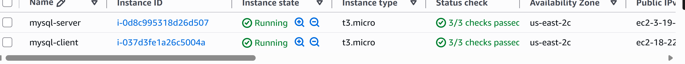

---
# Step 2: Install MySQL Server
SSH to teh servers  using teh public ip.
```bash
ssh -i ubuntu@<privatekey> public ip
```
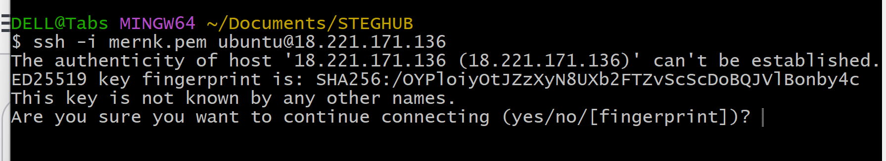


# Step 3: Install MySQL Server

SSH into the MySQL Server instance.

Update packages on both teh clieny and the server.

```bash
sudo apt update && sudo apt upgrade
```
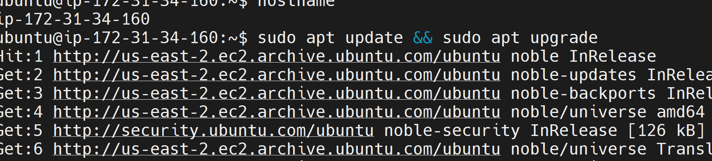 
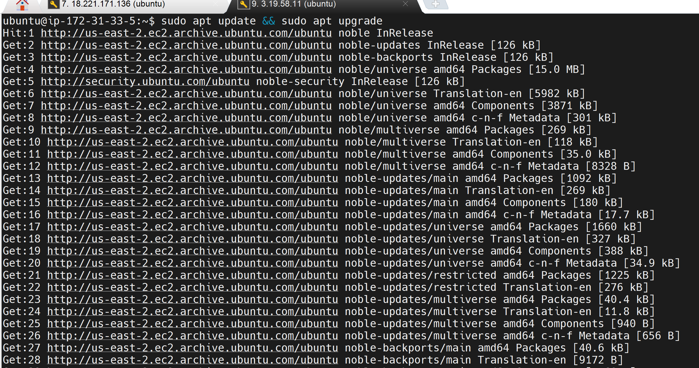 

Install MySQL Server.

```bash
sudo apt install mysql-server -y
```
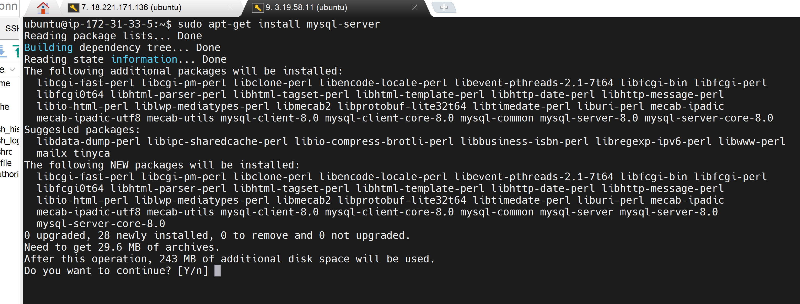 

Verify installation.

Enable MySQL.

```bash
sudo systemctl enable mysql
```
```bash
sudo systemctl status mysql
```
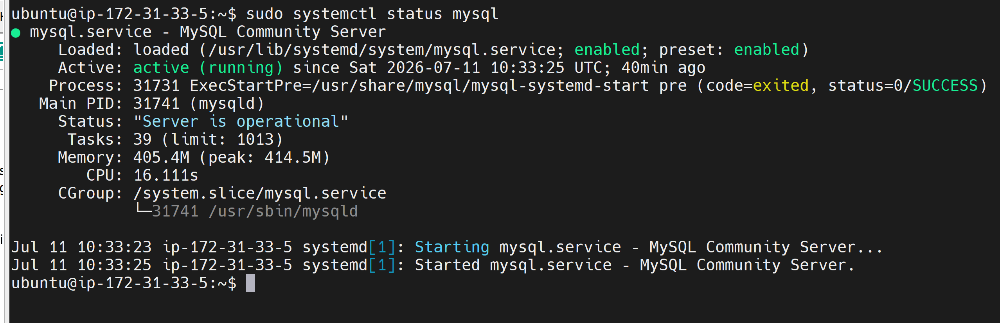 


---

# Step 4: Install MySQL Client

SSH into the MySQL Client instance.
ssh -i ubuntu@<privatekey> public ip

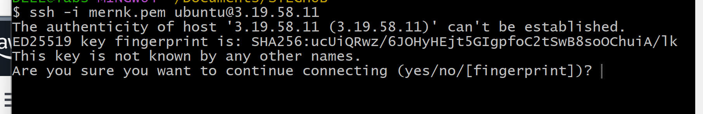

Update packages.

```bash
sudo apt update && sudo apt upgrade
```

Install MySQL Client.

```bash
sudo apt install mysql-client -y
```
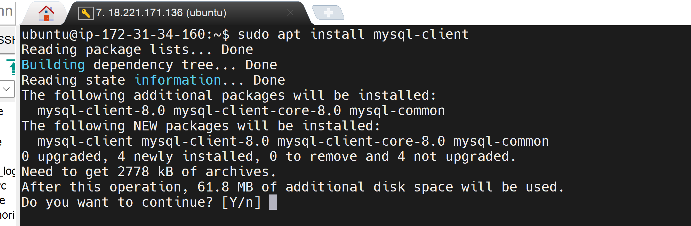

Verify installation.

```bash
mysql --version
```


---

# Step 5: Configure Security Groups

On the MySQL Server Security Group, allow inbound traffic on:

| Type | Protocol | Port | Source |
|------|----------|------|--------|
| MYSQL/Aurora | TCP | 3306 | MySQL Client Private IP |

This ensures only the client server can communicate with the MySQL Server.

---

## Screenshot


---

# Step 6: Configure MySQL for Remote Connections

Open the MySQL configuration file.

```bash
sudo vi /etc/mysql/mysql.conf.d/mysqld.cnf
```

Locate:

```text
bind-address = 127.0.0.1
```

Change it to:

```text
bind-address = 0.0.0.0
```

Save the file.
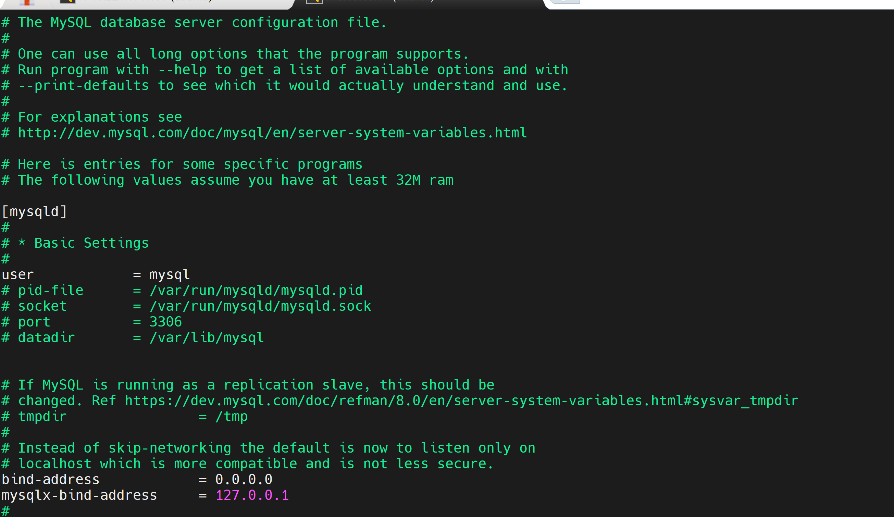

Restart MySQL.

```bash
sudo systemctl restart mysql
```

Verify MySQL is running.

```bash
sudo systemctl status mysql
```


---

# Step 6: Create a Remote Database User

Login to  MySQL server instance.

```bash
sudo mysql
```

Create a new remote user.

```sql
CREATE USER 'test'@'IP OF CLIENT' IDENTIFIED BY 'strongpassword';
```

Grant privileges.

```sql
GRANT ALL PRIVILEGES ON *.* TO 'test'@'IP OF CLIENT';
```

Reload privileges.

```sql
FLUSH PRIVILEGES;
```

Exit MySQL.

```sql
EXIT;
```

---

## Screenshot

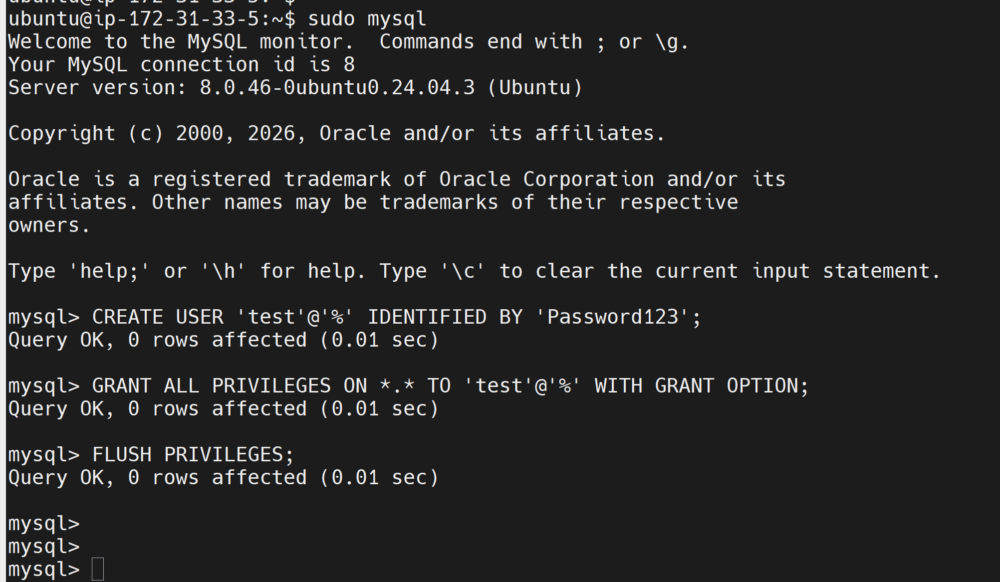


---

# Step 7: Connect Remotely from the Client Server

From the MySQL Client machine, connect to the MySQL Server.

```bash
mysql -u test -h 172.31.33.5 -p
```

Enter the password when prompted.

```
STRONG PASSWORD
```

If successful, you'll enter the MySQL shell.

---

## Screenshot


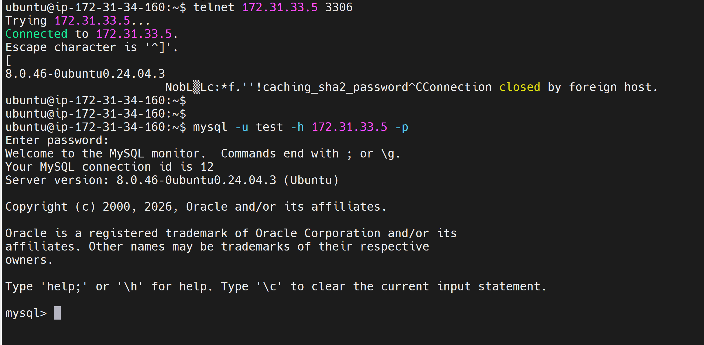


---

# Step 8: Verify the Connection

Run the following command.

```sql
SHOW DATABASES;
```
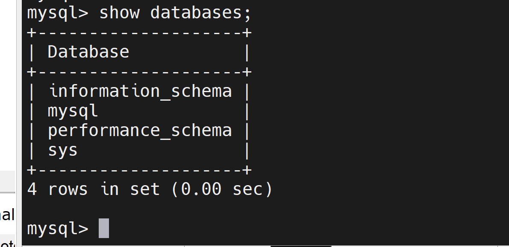 

Successful output confirms that the client has connected to the MySQL Server remotely.

Example:

```text
+--------------------+
| Database           |
+--------------------+
| information_schema |
| mysql              |
| performance_schema |
| sys                |
+--------------------+
```

---

# Key Concepts Learned

- Client-Server Architecture
- Amazon EC2
- MySQL Server Installation
- MySQL Client Installation
- AWS Security Groups
- Linux Package Management
- MySQL User Management
- Remote Database Access
- Database Authentication
- Network Security
- TCP/IP Communication
- Linux System Administration

---

# Troubleshooting

### Access denied

Ensure the MySQL user has permission to connect from the client host.

```sql
SELECT user, host FROM mysql.user;
```

---

### Can't connect to MySQL server

Verify MySQL is running.

```bash
sudo systemctl status mysql
```

---

Verify MySQL is listening on port 3306.

```bash
sudo ss -tlnp | grep 3306
```

---

Confirm the Security Group allows inbound traffic on port **3306** from the MySQL Client instance.

---

Check the bind address.

```text
bind-address = 0.0.0.0
```

---

# Technologies Used

- AWS EC2
- Ubuntu Linux
- MySQL Server
- MySQL Client
- SSH
- Linux Terminal

---

# Conclusion

This project successfully demonstrates a basic Client-Server architecture by deploying two AWS EC2 instances, configuring one as a MySQL Server and the other as a MySQL Client. Secure communication was established through AWS Security Groups and MySQL remote access configuration, allowing the client instance to connect to the database server without SSH and execute SQL commands over the network.
