# Web Solution with Wordpress
## Project Overview

This project demonstrates how to deploy a production-style **WordPress web application** using **two Red Hat Enterprise Linux (RHEL) EC2 instances** on AWS.

The architecture separates the web and database tiers:

- **Web Server:** Apache HTTP Server + PHP + WordPress
- **Database Server:** MariaDB
- **Storage:** LVM configured using multiple EBS volumes
- **Cloud Platform:** Amazon EC2

---

# Project Architecture

> **Insert Architecture Diagram**

```
                Internet
                    │
            ┌───────────────┐
            │ Security Group│
            └───────┬───────┘
                    │
             Port 80 / 443
                    │
          ┌────────────────────┐
          │  Web Server (RHEL) │
          │ Apache + PHP       │
          │ WordPress          │
          └─────────┬──────────┘
                    │
               Port 3306
                    │
          ┌────────────────────┐
          │ Database Server    │
          │ MariaDB            │
          └────────────────────┘
```

---

# Prerequisites

Before beginning, ensure you have:

- AWS Account
- Two Red Hat EC2 Instances
- SSH Key Pair
- Two Security Groups
- Internet Gateway
- Public Subnet
- Amazon EBS Volumes

---

# Solution Components

| Server | Purpose |
|---------|----------|
| Web Server | Hosts Apache, PHP and WordPress |
| Database Server | Hosts MariaDB database |

---

# Part 1 — Launch the Web Server

Launch one Red Hat EC2 instance that will act as the **Web Server**.

### AWS Configuration

- AMI: Red Hat Enterprise Linux
- Instance Type: t2.micro (or preferred)
- Security Group
  - SSH (22)
  - HTTP (80)
  - HTTPS (443)

### Screenshot

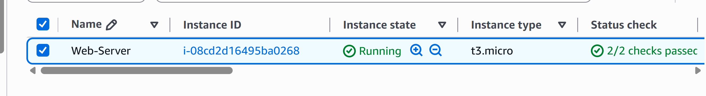 

---

# Part 2 — Create and Attach EBS Volumes

Create **three 10 GiB EBS volumes** in the same Availability Zone as the Web Server.

Attach all three volumes to the EC2 instance.

### Screenshot

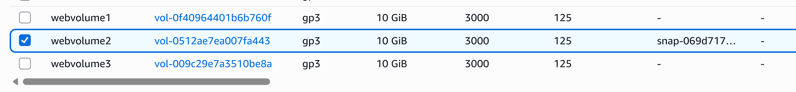 
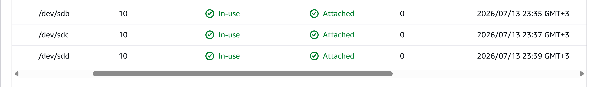 

---

# Part 3 — Connect to the Web Server

SSH into the server.

### Commands

```bash
ssh -i key.pem ec2-user@<Public-IP>
```

Verify the attached disks.

```bash
lsblk
ls /dev/
```

### Screenshot

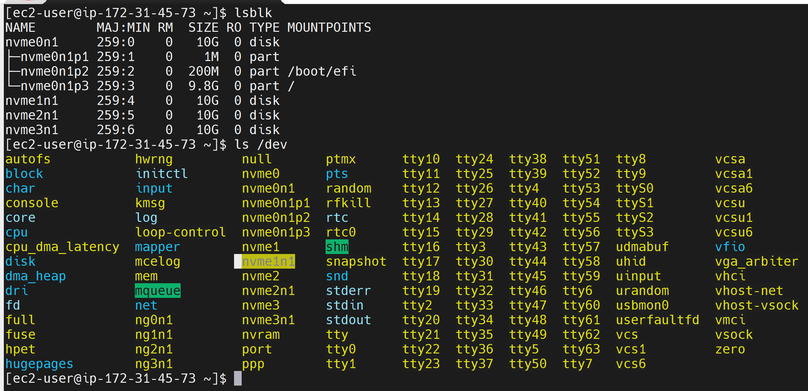

---

# Part 4 — Partition the Disks

Use **gdisk** to create one partition on each attached disk.

### Commands

```bash
sudo gdisk /dev/nvme1n1
sudo gdisk /dev/nvme2n1
sudo gdisk /dev/nvme2n1
```
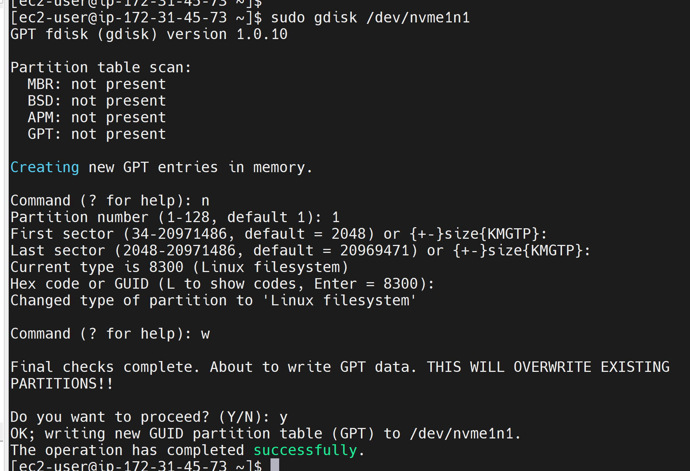

Verify the partitions.

```bash
lsblk
```

### Screenshot

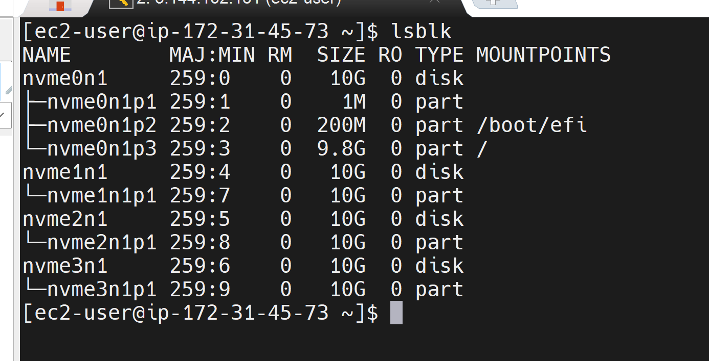

---

# Part 5 — Configure LVM

Install the LVM2 package.

### Commands

```bash
sudo yum install lvm2 -y
```
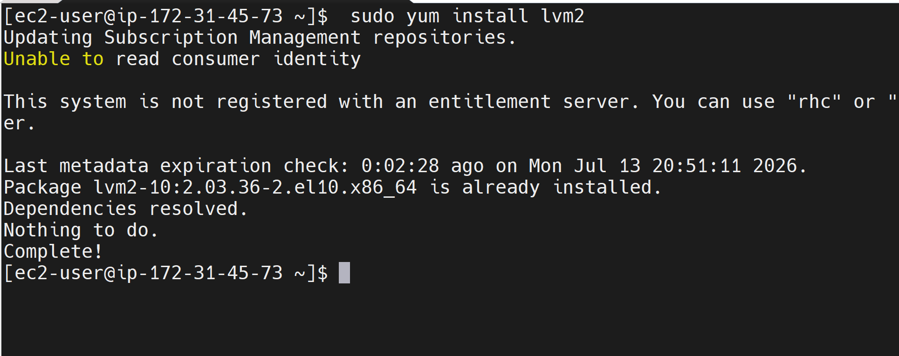

Create Physical Volumes.

```bash
sudo pvcreate /dev/nvme1n1p1
sudo pvcreate /dev/nvme2n1p1
sudo pvcreate /dev/nvme3n1p1
```

Verify.

```bash
sudo pvs
```

### Screenshot

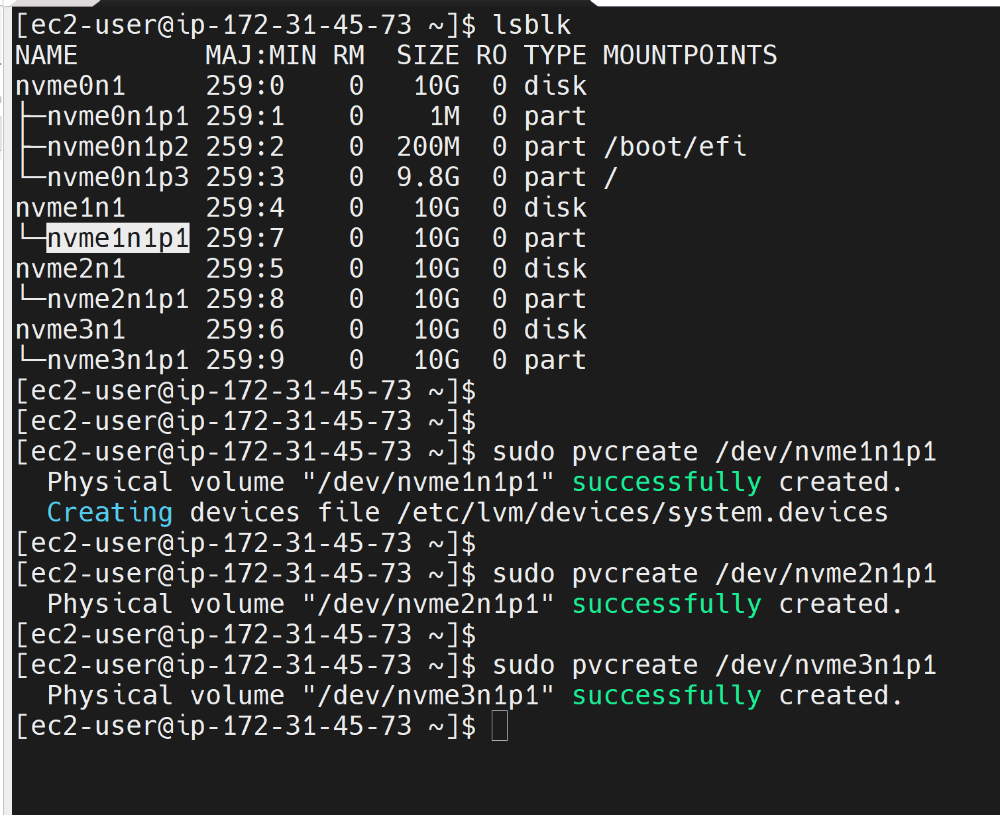
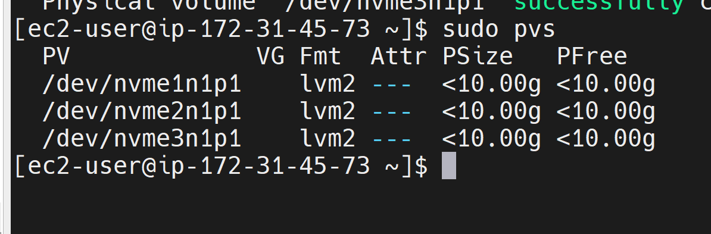

---

# Part 6 — Create a Volume Group

Create a Volume Group named **webdata-vg**.

### Commands

```bash
sudo vgcreate webdata-vg /dev/nvme1n1p1 /dev/nvme2n1p1 /dev/nvme3n1p1
```

Verify.

```bash
sudo vgs
```

### Screenshot

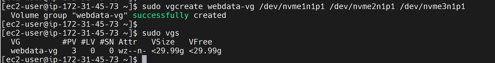

---

# Part 7 — Create Logical Volumes

Create two logical volumes:

- apps-lv
- logs-lv

### Commands

```bash
sudo lvcreate -L 14G -n apps-lv webdata-vg

sudo lvcreate -L 14G -n logs-lv webdata-vg
```

Verify.

```bash
sudo lvs
```

### Screenshot

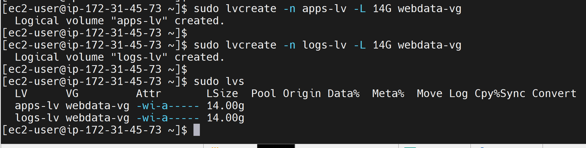

---

# Part 8 — Format the Logical Volumes

Format both logical volumes with ext4.

### Commands

```bash
sudo mkfs.ext4 /dev/webdata-vg/apps-lv

sudo mkfs.ext4 /dev/webdata-vg/logs-lv
```

### Screenshot

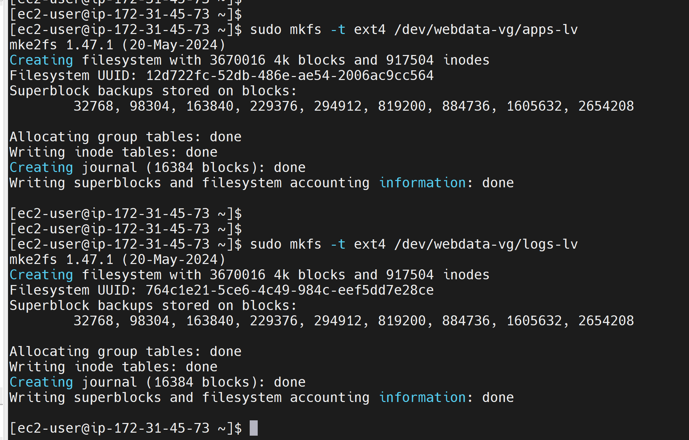

---

# Part 9 — Create Mount Directories

Create the required directories.

### Commands

```bash
sudo mkdir -p /var/www/html

sudo mkdir -p /home/recovery/logs
```

### Screenshot
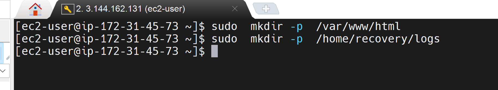


---

# Part 10 — Mount the Logical Volumes

Mount the application volume.

```bash
sudo mount /dev/webdata-vg/apps-lv /var/www/html
```
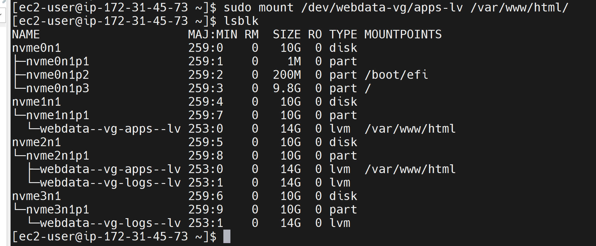

Backup existing logs.

```bash
sudo rsync -av /var/log/ /home/recovery/logs/
```
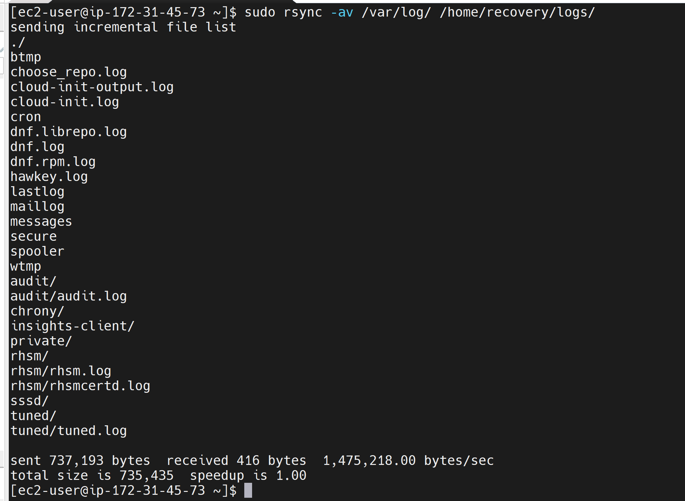
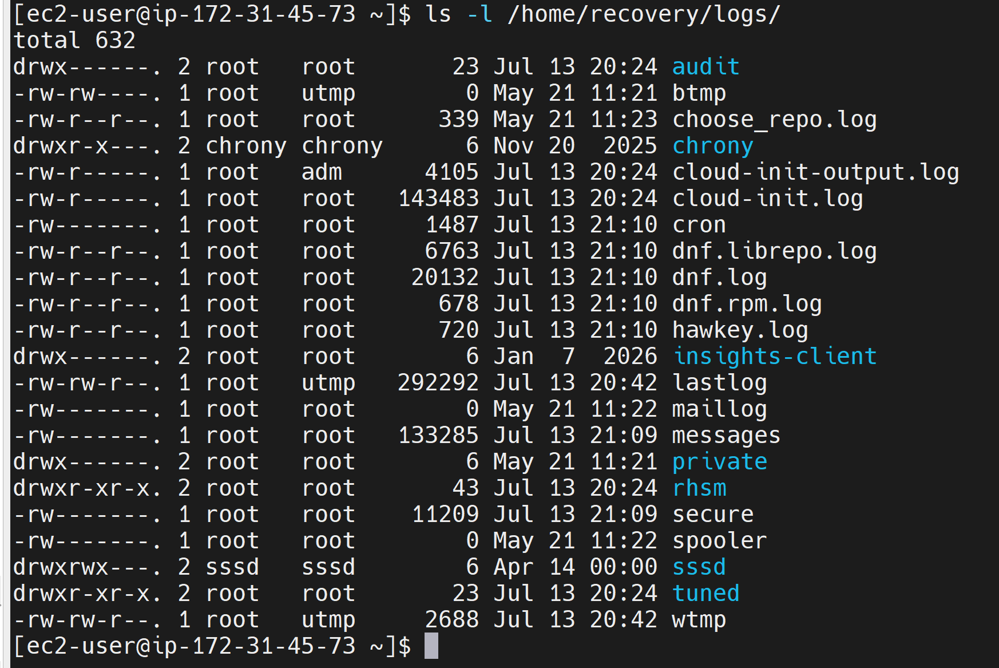

Mount the logs volume.

```bash
sudo mount /dev/webdata-vg/logs-lv /var/log
```
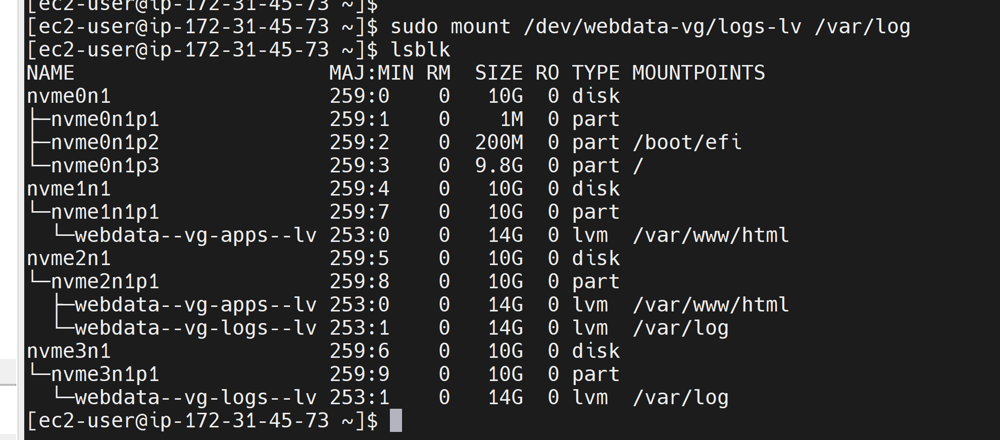 

Restore the logs.

```bash
sudo rsync -av /home/recovery/logs/ /var/log/
```

### Screenshot

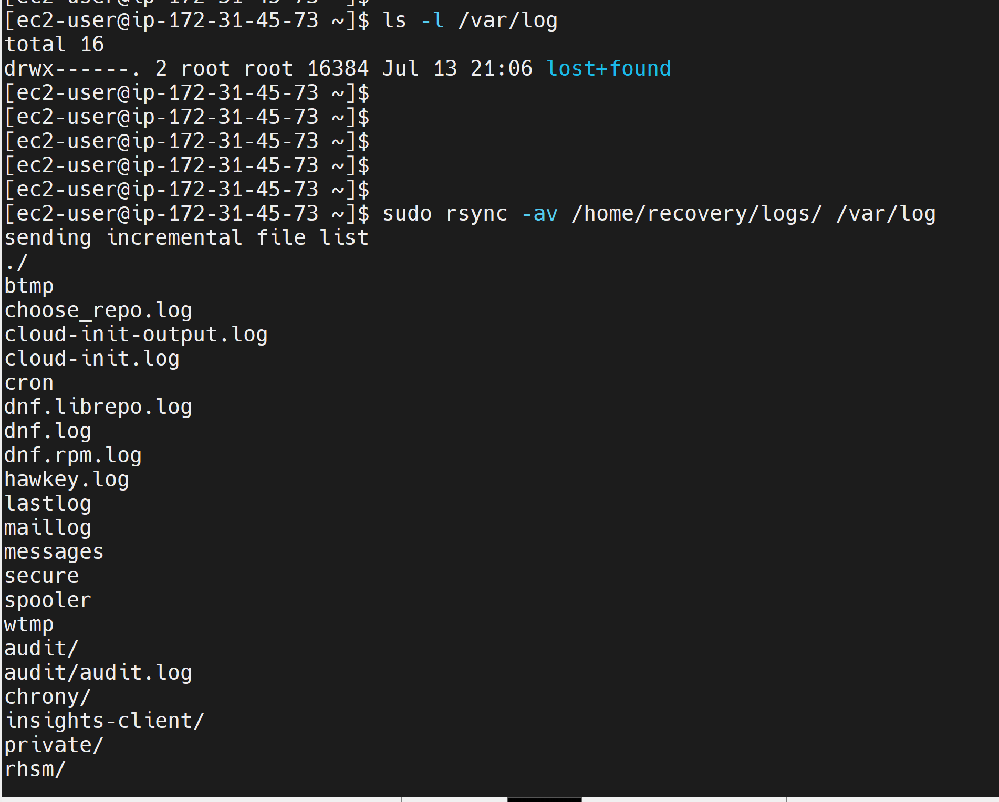 

---

# Part 11 — Configure Persistent Mounts

Obtain UUID values.

### Commands

```bash
sudo blkid
```

Update the **/etc/fstab** file.

```bash
sudo vi /etc/fstab
```

Test the configuration.

```bash
sudo mount -a

sudo systemctl daemon-reload
```

Verify.

```bash
df -h
```

### Screenshot

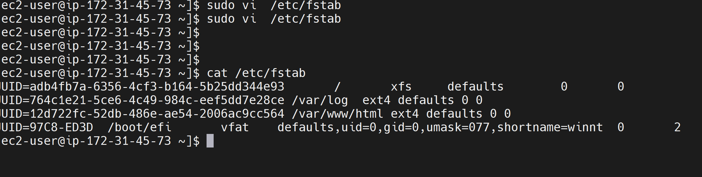 

---

# Part 12 — Prepare the Database Server

Launch another Red Hat EC2 instance.

This server will host **MariaDB**.I used MariaDB as mysql pckage is not available on redhat verion 10.

Repeat the following storage configuration steps:

- Create three EBS volumes
- Partition disks
- Configure LVM
- Create Volume Group
- Create Logical Volume

Create one logical volume named:

```
db-lv
```

Mount it to:

```
/db
```
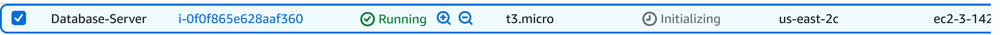 

# Create and Attach EBS Volumes

Create **three 10 GiB EBS volumes** in the same Availability Zone as the Web Server.

Attach all three volumes to the EC2 instance.

### Screenshot

 
 

---

# Connect to the Web Server

SSH into the server.

### Commands

```bash
ssh -i key.pem ec2-user@<Public-IP>
```

Verify the attached disks.

```bash
lsblk
ls /dev/
```

### Screenshot


---

# Partition the Disks

Use **gdisk** to create one partition on each attached disk.

### Commands

```bash
sudo gdisk /dev/nvme1n1
sudo gdisk /dev/nvme2n1
sudo gdisk /dev/nvme2n1
```


Verify the partitions.

```bash
lsblk
```

### Screenshot


---

# Configure LVM

Install the LVM2 package.

### Commands

```bash
sudo yum install lvm2 -y
```


Create Physical Volumes.

```bash
sudo pvcreate /dev/nvme1n1p1
sudo pvcreate /dev/nvme2n1p1
sudo pvcreate /dev/nvme3n1p1
```

Verify.

```bash
sudo pvs
```

### Screenshot


---

# Create a Volume Group

Create a Volume Group named **webdata-vg**.

### Commands

```bash
sudo vgcreate webdata-vg /dev/nvme1n1p1 /dev/nvme2n1p1 /dev/nvme3n1p1
```

Verify.

```bash
sudo vgs
```


---

# Part 13 — Install Apache, PHP and Required Packages

Install Apache and PHP on the Web Server.

### Commands

```bash
sudo yum install wget httpd php-mysqlnd php-fpm php-json
```

Enable and start Apache.

```bash
sudo systemctl enable httpd
```

Verify Apache status.

```bash
sudo systemct status httpd
```

### Screenshot

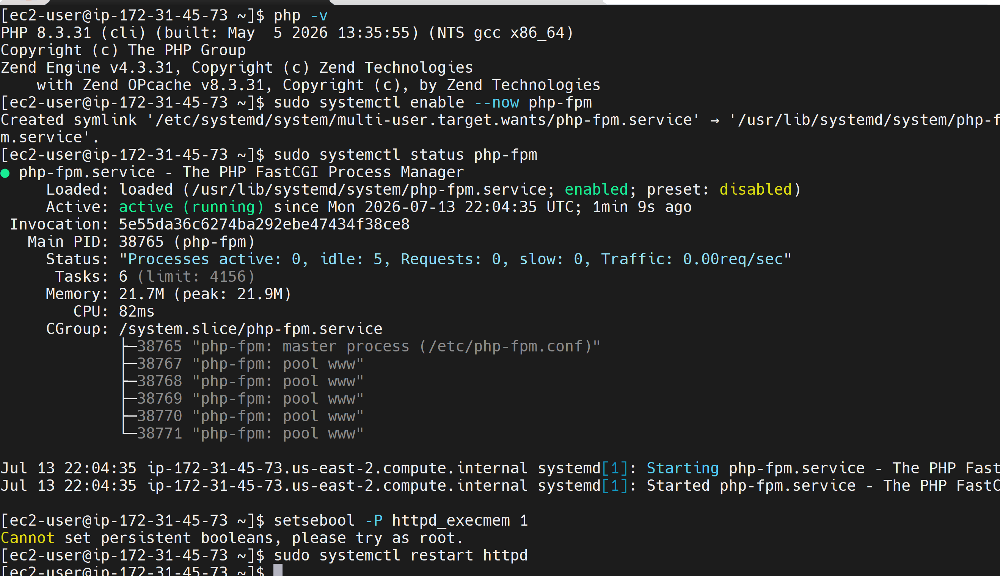
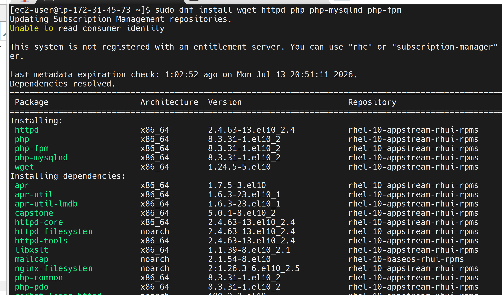

---

# Part 14 — Download and Install WordPress

Download the latest WordPress package.

Extract the archive.

Copy WordPress files into:

```
/var/www/html
```

Configure file ownership and permissions.

### Commands
Make dir Wordpress
```bash
mkdir wordpress $$ cd wordpress
sudo wget http://wordpress.org/latest.tar.gz
sudo tar -xzvf latest.tar.gz
```
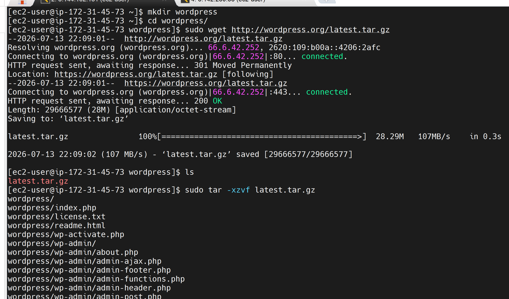

---

# Part 15 — Configure SELinux

Configure SELinux so Apache can access WordPress files.

Update the required contexts and booleans.

### Commands

```bash
sudo chown -R apache:apache /var/www/html/wordpress
sudo chcon -t httpd_sys_rw_content_t /var/www/html/wordpress -R
sudo setsebool -P httpd_can_network_connect=1
```

### Screenshot

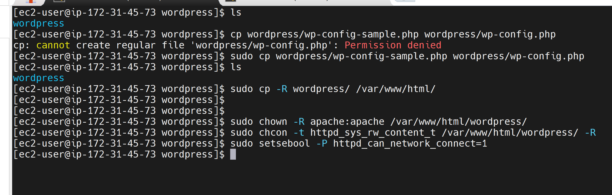

---

# Part 16 — Install MariaDB on the Database Server

Install MariaDB Server.

### Commands

```bash
sudo yum install -y mariadb-server
sudo systemctl enable --now mariadb
```

Enable the MariaDB service.

```bash
sudo systemctl enable --now mariadb
```

Verify the service is running.
```bash
sudo systemctl status mariadb
```

### Screenshot

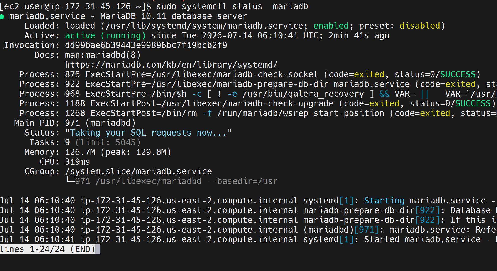

---

# Part 17 — Configure the WordPress Database

Create:

- Database
- Database User
- Password

Grant privileges.

Flush privileges.

### Commands

```sql
CREATE DATABASE wordpress;
CREATE USER 'testuser'@'172.31.45.73' IDENTIFIED BY 'Password123!';
GRANT ALL PRIVILEGES ON wordpress.* TO 'testuser'@'172.31.45.73';
FLUSH PRIVILEGES;
EXIT;
```

### Screenshot

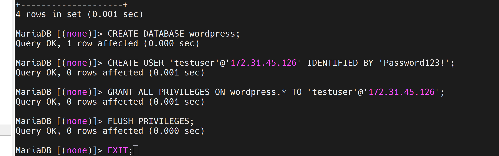

---

# Part 18 — Configure Remote Database Access

Edit the MariaDB configuration to allow remote connections.

Restart MariaDB.

Update the Security Group to allow **TCP 3306** only from the Web Server.

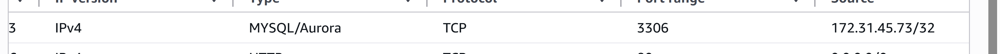
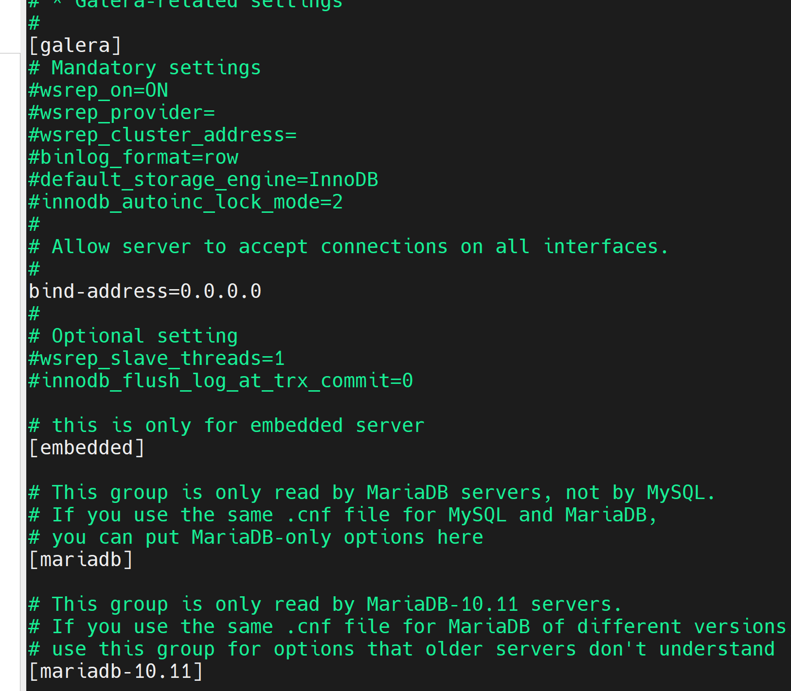

---

# Part 19 — Configure WordPress

Edit the WordPress configuration file.

Update:

- Database Name
- Username
- Password
- Database Host

### Screenshot

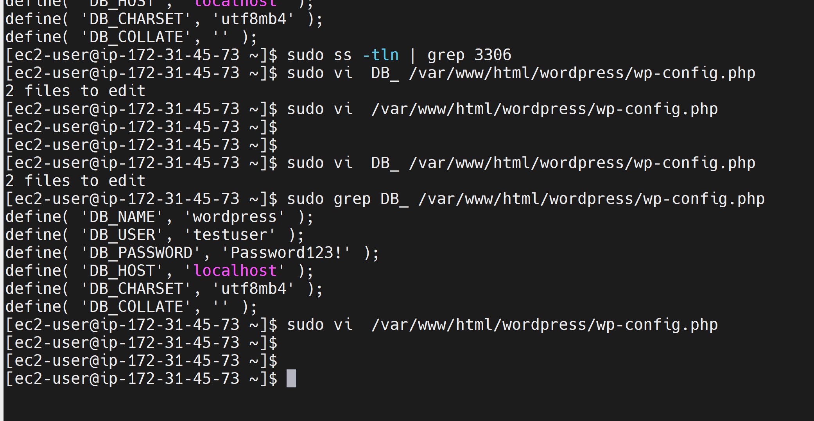

---

# Part 20 — Install MariaDB Client on the Web Server

Install the MariaDB client packages.

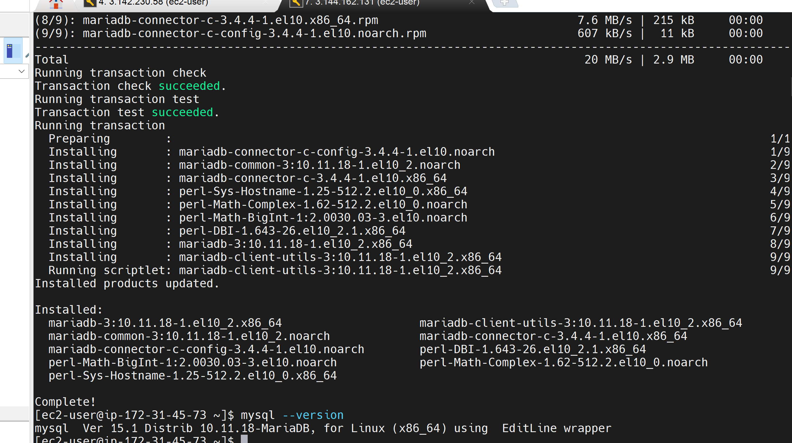

Test remote connectivity.
### Commands

```bash
sudo mysql -u testuser -h 172.31.45.126 -p
show DATABASES;
```

### Screenshot

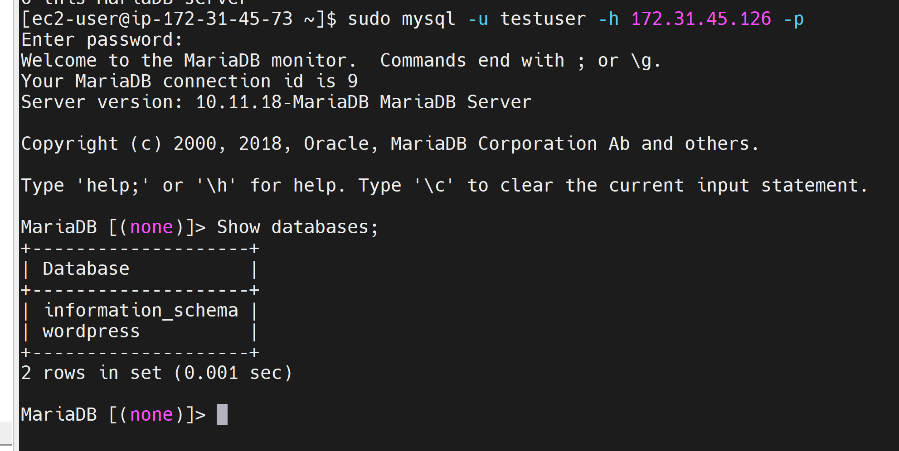

---

# Part 21 — Restart Apache

Restart Apache to apply all changes.

### Commands

```bash
sudo systemctl restart apache
```

Verify the service.

### Screenshot

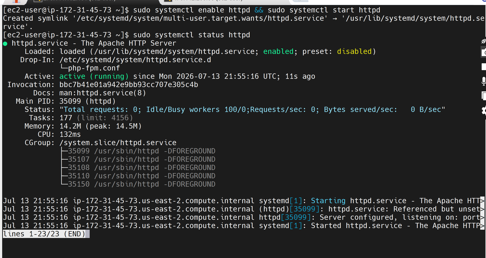

---

# Part 22 — Configure Security Groups

Ensure the following ports are open.

| Port | Purpose |
|-------|----------|
| 22 | SSH |
| 80 | HTTP |
| 443 | HTTPS |
| 3306 | MariaDB (Web Server only) |

### Screenshot

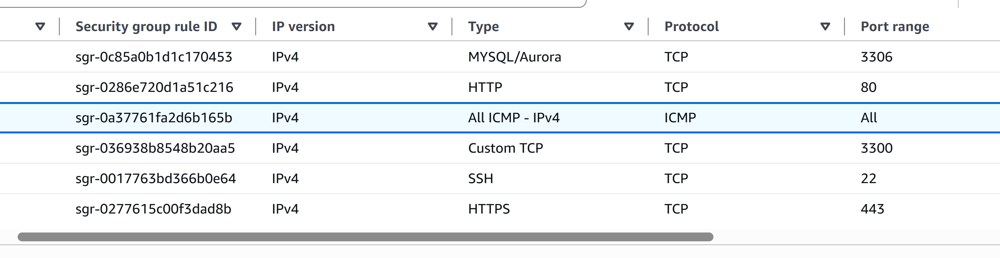

---

# Part 23 — Access WordPress

Open a browser.

Navigate to:

```
http://<Web-Server-Public-IP>
```

Complete the WordPress installation wizard.

### Screenshot

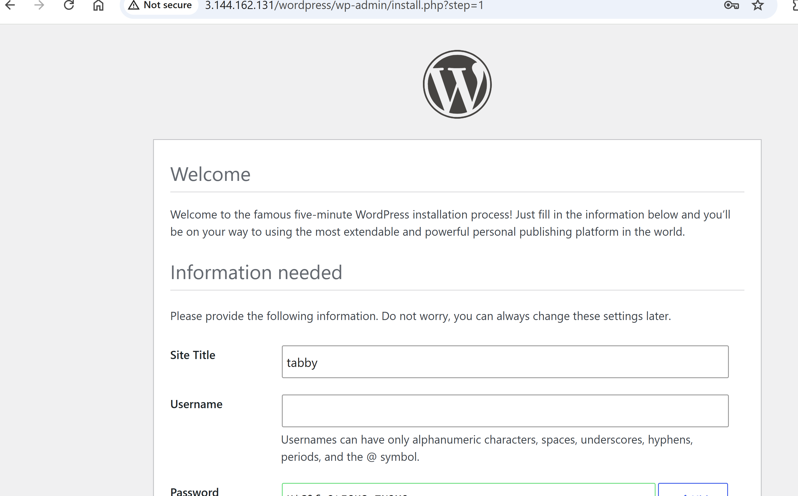
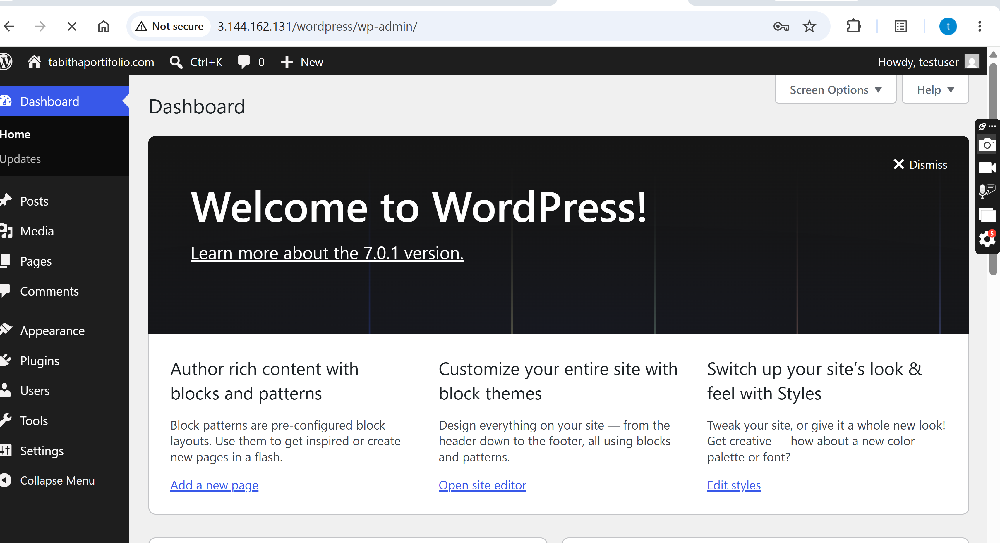


---

---

# Project Outcome

In this project, a highly available two-tier web architecture was implemented using two Red Hat EC2 instances. The web tier hosts Apache, PHP, and WordPress, while the database tier hosts MariaDB on a dedicated server. Logical Volume Management (LVM) was used to provide flexible storage management with multiple EBS volumes, and the two servers communicate securely over the network to deliver a functional WordPress website backed by a remote MariaDB database.

---

# Technologies Used

- AWS EC2
- Amazon EBS
- Red Hat Enterprise Linux
- Apache HTTP Server
- PHP
- WordPress
- MariaDB
- LVM (Logical Volume Manager)
- SELinux
- SSH

---

