# Tooling Website Solution on AWS

## Project Overview

This project demonstrates how to deploy a highly available **Tooling Website** on **AWS** using a three-tier architecture. The solution uses a centralized **NFS file server** for shared application storage, a dedicated **MySQL database server**, and multiple **Red Hat Enterprise Linux web servers** running **Apache** and **PHP**.

### Architecture

| Component | Technology |
|-----------|------------|
| Cloud Platform | AWS |
| Web Servers | Red Hat Enterprise Linux 8 |
| Database Server | Ubuntu Server 24.04 + MySQL |
| Storage Server | Red Hat Enterprise Linux 8 + NFS |
| Programming Language | PHP |
| Version Control | GitHub |

---

# Solution Architecture


***Architecturere diagram***

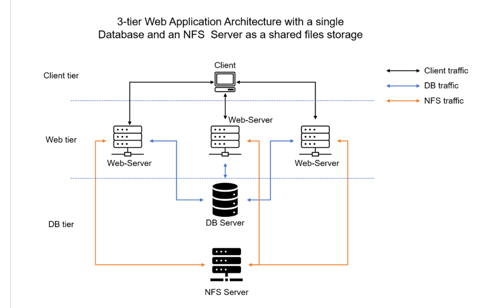


---

# Step 1: Prepare the NFS Server

Launch a **Red Hat Enterprise Linux 8 EC2 instance** that will act as the centralized storage server.

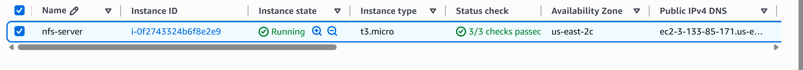

---

## Create and Attach EBS Volumes

Create **three 10 GiB EBS volumes** in the same Availability Zone as the instance (`us-east-2c`) and attach them.
## Verify Attached Disks

```bash
lsblk
```

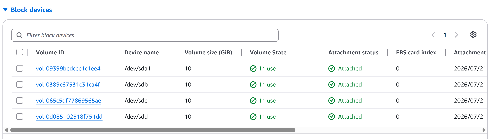

---

## Create Physical Volumes

Install the lvm2 utility

```bash
sudo yum install  lvm2 -y
```

```bash
sudo pvcreate /dev/nvme1n1
sudo pvcreate /dev/nvme2n1
sudo pvcreate /dev/nvme3n1

sudo pvs
```

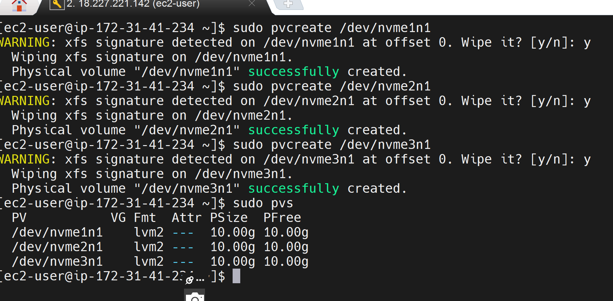

---

## Create Volume Group

Create a volume group named **webdata-vg**.

```bash
sudo vgcreate webdata-vg /dev/nvme1n1 /dev/nvme2n1 /dev/nvme3n1

sudo vgs
```

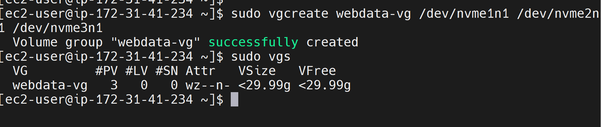

---

## Create Logical Volumes

Create three logical volumes for applications, logs, and Jenkins.

| Logical Volume | Mount Point | Purpose |
|---------------|-------------|----------|
| lv-opt | /mnt/opt | Jenkins Server |
| lv-apps | /mnt/apps | Web Applications |
| lv-logs | /mnt/logs | Apache Logs |

```bash
sudo lvcreate -L 10G -n lv-opt webdata-vg
sudo lvcreate -L 10G -n lv-apps webdata-vg
sudo lvcreate -L 10G -n lv-logs webdata-vg

sudo lvs
```

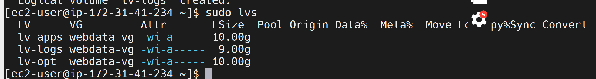

---

## Format the Disks

```bash
sudo mkfs.xfs /dev/webdata-vg/lv-opt
sudo mkfs.xfs /dev/webdata-vg/lv-apps
sudo mkfs.xfs /dev/webdata-vg/lv-logs
```
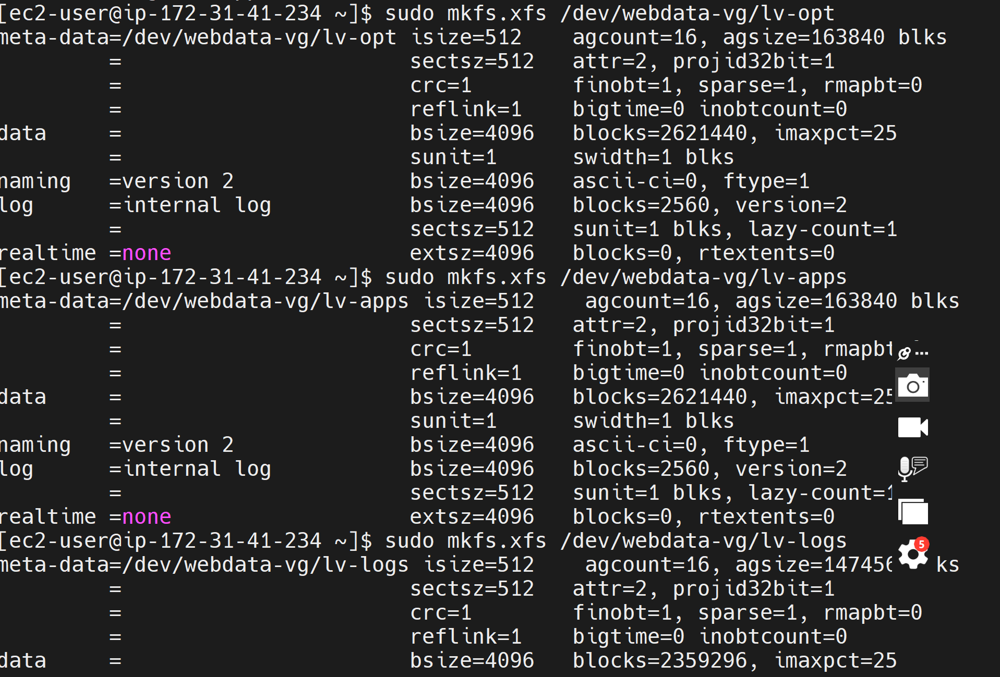
---

## Create Mount Directories

```bash
sudo mkdir /mnt/opt
sudo mkdir /mnt/apps
sudo mkdir /mnt/logs
```

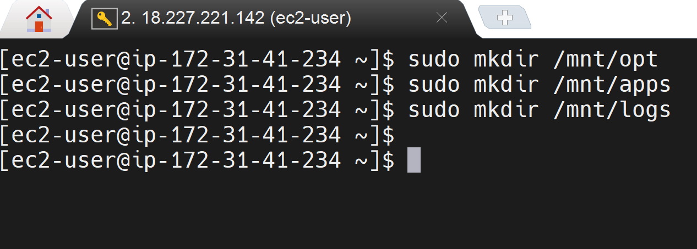


---

## Mount the Logical Volumes

```bash
sudo mount /dev/webdata-vg/lv-opt /mnt/opt
sudo mount /dev/webdata-vg/lv-apps /mnt/apps
sudo mount /dev/webdata-vg/lv-logs /mnt/logs

df -h
```

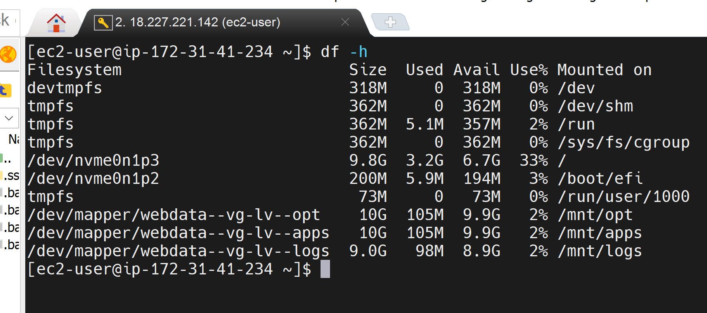

---

## Configure Persistent Mounts

Retrieve the UUIDs:

```bash
sudo blkid
```

Update **/etc/fstab** with the UUIDs, then verify.

```bash
sudo mount -a
sudo systemctl daemon-reload
df -h
```

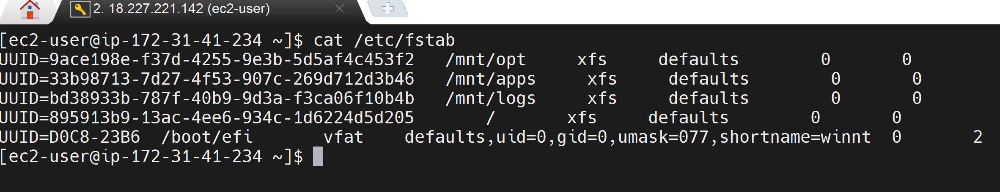

---

# Step 2: Install and Configure the NFS Server

Update the server.

```bash
sudo yum -y update
```
Install NFS utilities.

```bash
sudo yum install nfs-utils -y
```
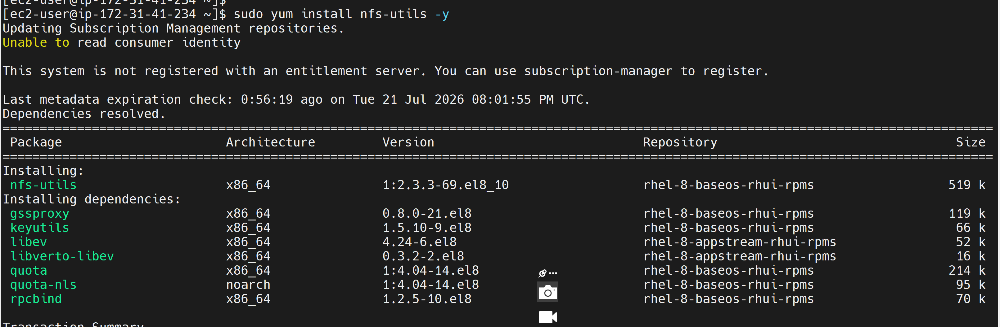

Start and enable the service.

```bash
sudo systemctl start nfs-server.service
sudo systemctl enable nfs-server.service
sudo systemctl status nfs-server.service
```

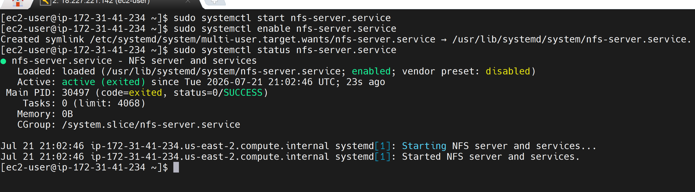

---

## Configure Directory Permissions to allow webservers to read write execute files on NFS.

```bash
sudo chown -R nobody: /mnt/apps
sudo chown -R nobody: /mnt/logs
sudo chown -R nobody: /mnt/opt

sudo chmod -R 777 /mnt/apps
sudo chmod -R 777 /mnt/logs
sudo chmod -R 777 /mnt/opt

sudo systemctl restart nfs-server.service
```

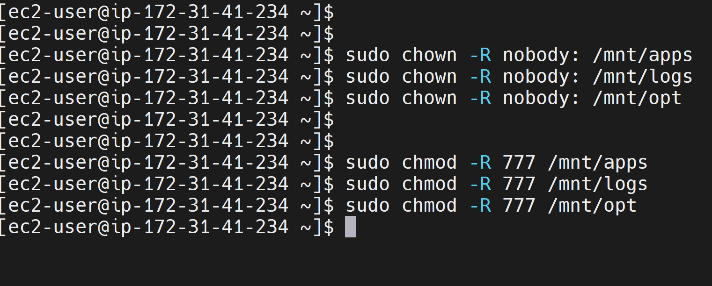

---

## Configure Access to  NFS for clients within the same subnet.

Edit the exports file.

```bash
sudo vi /etc/exports
```

Add:

```text
/mnt/apps 172.31.32.0/20(rw,sync,no_all_squash,no_root_squash)
/mnt/logs 172.31.32.0/20(rw,sync,no_all_squash,no_root_squash)
/mnt/opt 172.31.32.0/20(rw,sync,no_all_squash,no_root_squash)
```

Apply the configuration.

```bash
sudo exportfs -arv
```

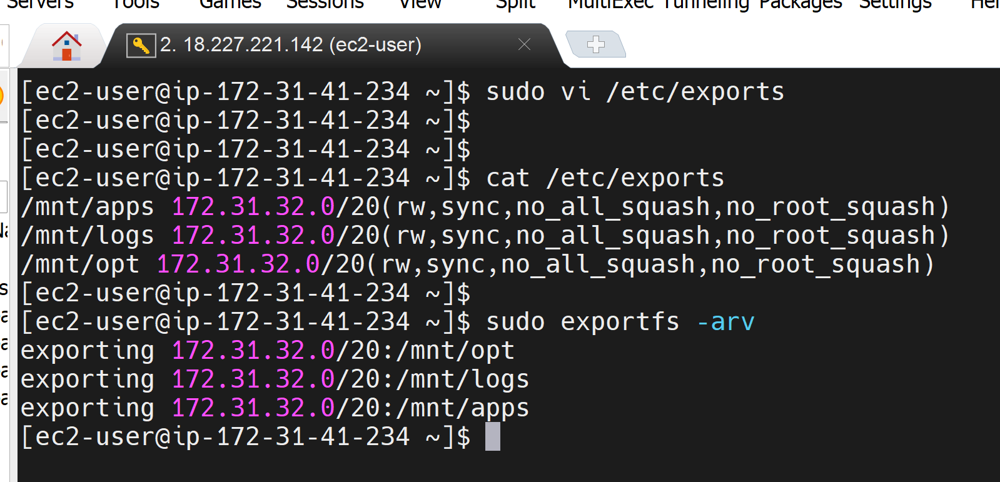

---

## Verify NFS Ports

```bash
rpcinfo -p | grep nfs
```

Open the following ports in the NFS server security group.

| Protocol | Port |
|----------|------|
| TCP | 111 |
| UDP | 111 |
| TCP/UDP | 2049 |

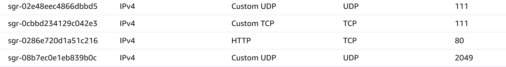

---

# Step 3: Configure the Database Server

Launch an **Ubuntu Server 24.04 EC2 instance**.


---

## Install MySQL

```bash
sudo apt update && sudo apt upgrade
sudo apt install mysql-server -y
```

Verify the installation.

```bash
sudo systemctl status mysql
sudo systemctl enable mysql

mysql --version
```
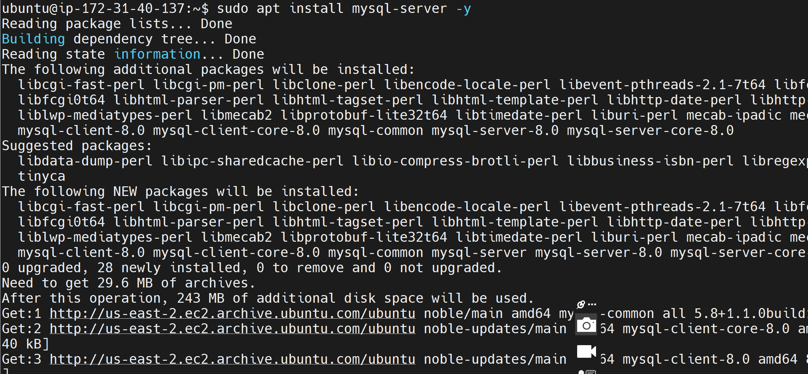
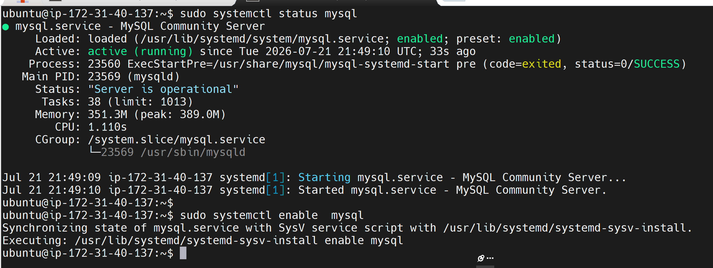

---

## Secure MySQL

```bash
sudo mysql_secure_installation
```

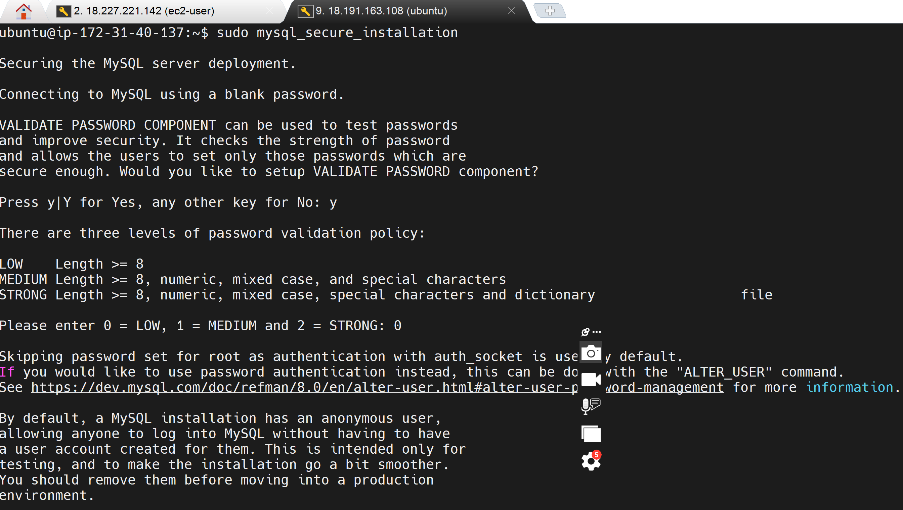

---

## Create the Database

Login.

```bash
sudo mysql
```

Create the database and user.

```sql
CREATE DATABASE tooling;

CREATE USER 'webaccess'@'172.31.32.%' IDENTIFIED BY 'Password123!';

GRANT ALL PRIVILEGES ON tooling.* TO 'webaccess'@'172.31.32.%';

FLUSH PRIVILEGES;

SELECT User, Host FROM mysql.user;
```

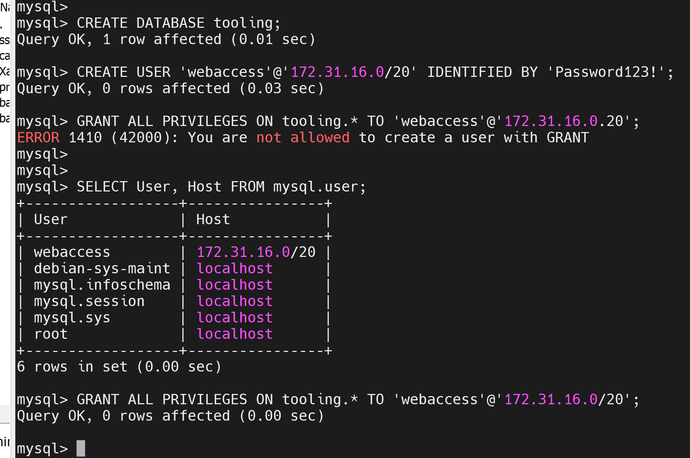

Edit the /etc/mysql/mysql.conf.d on teh bind address to allow connection from the webservers.


---


---

# Step 4: Prepare the Web Servers

Launch 3 **RHEL 8 EC2 instances**.

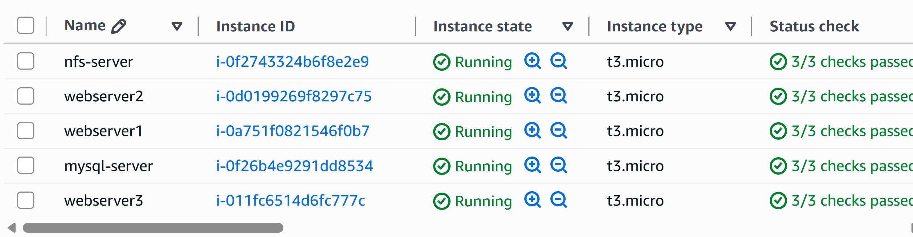

---

## Configure Security Group

Allow:

- SSH (22)
- HTTP (80)

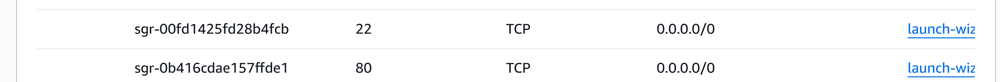

---

## Install NFS Client

```bash
sudo yum install nfs-utils nfs4-acl-tools -y
```


---

## Mount the Shared NFS Directory

```bash
sudo mkdir -p /var/www

sudo mount -t nfs -o rw,nosuid \
<NFS-Private-IP>:/mnt/apps /var/www

df -h
```

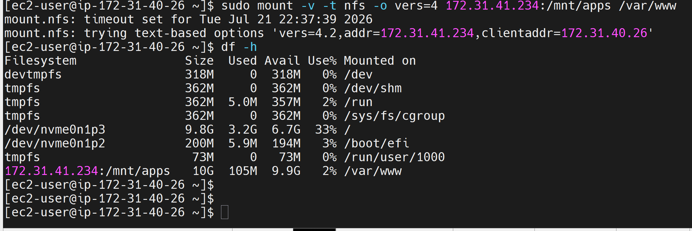

---

## Configure Persistent Mount

Edit `/etc/fstab`.

```text
<NFS-Private-IP>:/mnt/apps /var/www nfs defaults 0 0
```
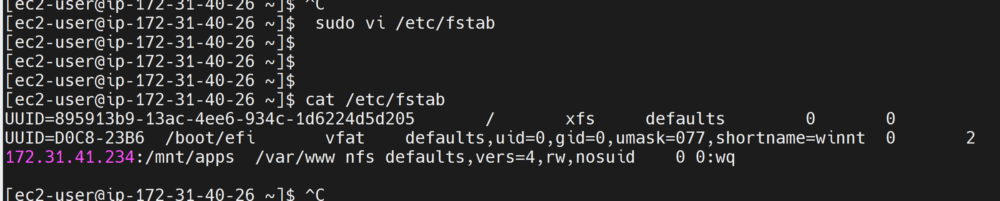

Test it.

```bash
sudo umount /var/www

sudo mount -a
```

---

## Install Apache and PHP

```bash
sudo yum install httpd -y
sudo dnf install https://dl.fedoraproject.org/pub/epel/epel-release-latest-8.noarch.rpm
sudo dnf install dnf-utils http://rpms.remirepo.net/enterprise/remi-release-8.rpm

sudo dnf module reset php -y

sudo dnf module enable php:remi-7.4 -y

sudo dnf install php php-opcache php-gd php-curl php-mysqlnd 

sudo systemctl enable httpd --now

sudo systemctl enable php-fpm --now
sudo setsebool -P httpd_execmem 1

```

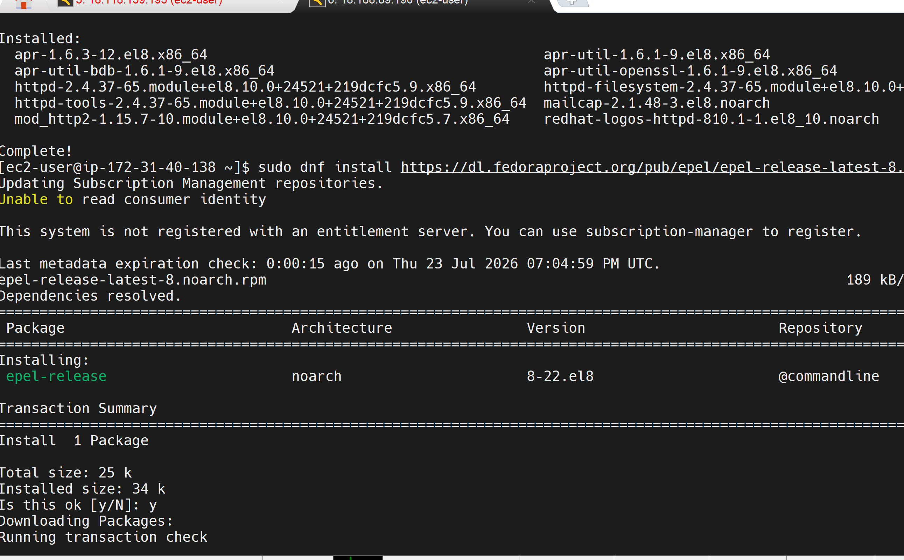 
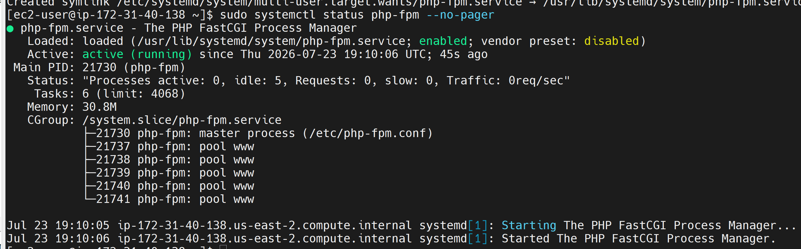

---

## Repeat for two Additional Web Servers

Repeat the above installation and NFS mounting process for every web server.

---

## Verify Shared Storage

On **Web Server 1**:

```bash
cd /var/www

sudo touch test.txt
```

On **Web Server 2**:

```bash
ls /var/www
```

If the file is visible, shared storage is working correctly.

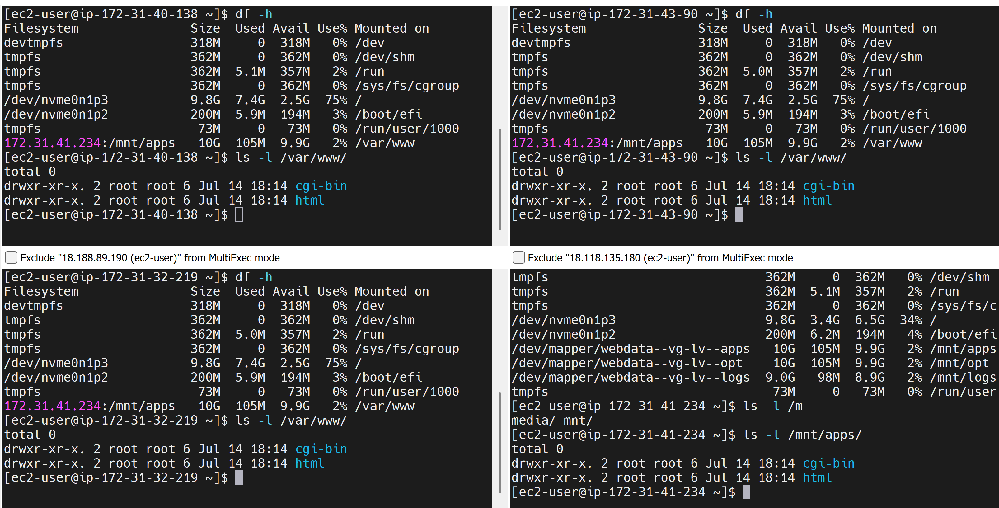
Create a test.txt on one file and chekc if you can access it form the other servers.
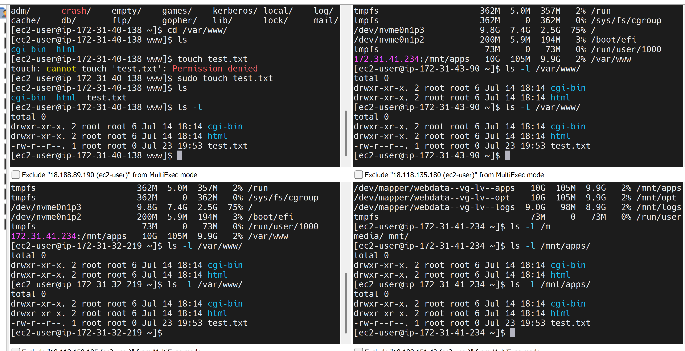

---

## Mount Apache Logs to NFS.Do the same for all the three servers.

Mount the Apache log directory (`/var/log/httpd`) to the exported `/mnt/logs` directory on the NFS server and configure `/etc/fstab` for persistence.
```bash
sudo mount -t nfs -o rw,nosuid \
172.31.41.234:/mnt/logs /var/log/httpd
```
Edit /etc/fstab and add teh follwoing
```bash
172.31.41.234:/mnt/logs /var/log/httpd nfs defaults 0 0
```
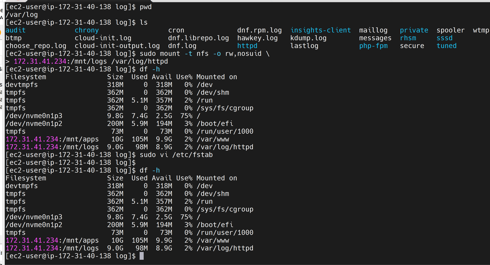
---

# Step 5: Deploy the Tooling Application

Fork the Github repo for the project form teh github interface


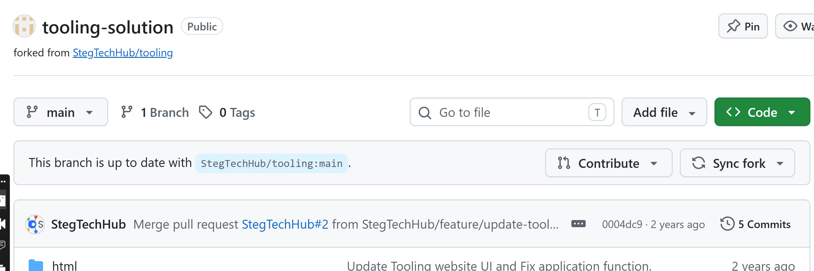

From the Webserver Clon ethe forked repo form your github.
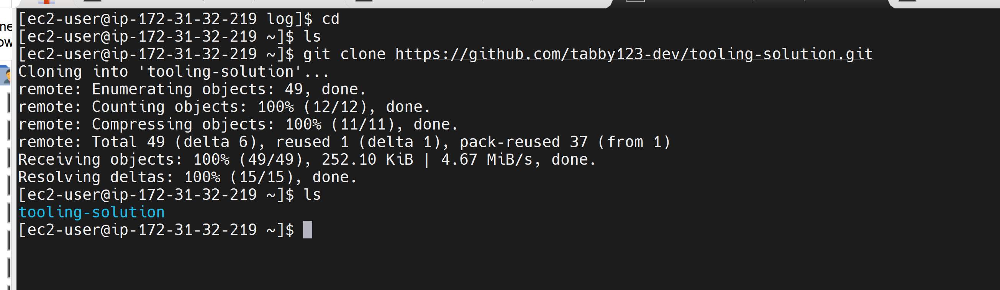

Copy the files form the folder to the mounted folder.

```bash
sudo cp -R tooling-solution/html/* /var/www/html/
```
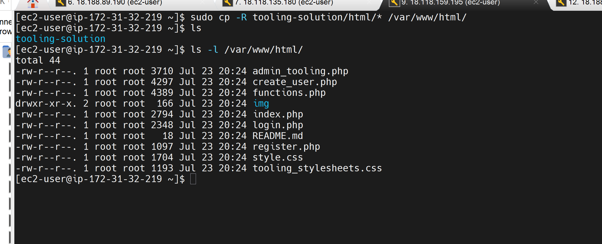

---

## Configure Database Connection

Edit:

```text
/var/www/html/functions.php
```

Update the database configuration.

```php
$db = mysqli_connect(
    "172.31.40.000",
    "webess",
    "Pas",
    "tooling"
);
```
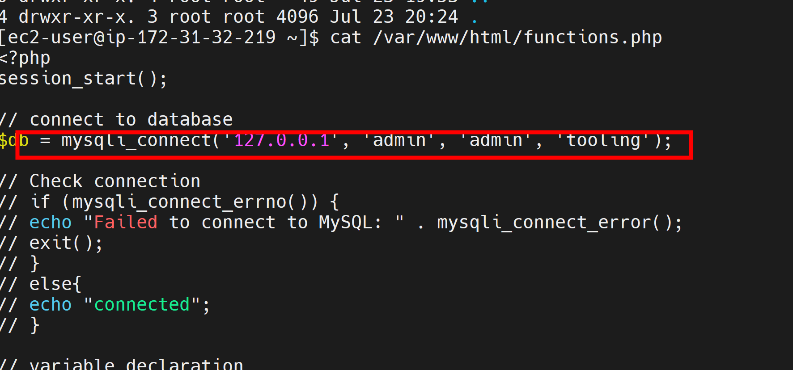
---

## Import the Database
You need to ha mysql client installed on teh server for the command to run.

```bash
mysql -h 172.31.40.137 \
-u webaccess -p tooling < tooling-db.sql
```
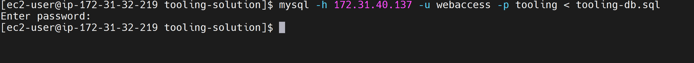
---

## Create an Administrator Account

Login to MySQL.

```bash
mysql -h <database-private-ip> -u webaccess -p
```

```sql
USE tooling;

INSERT INTO users
(username, password, email, user_type, status)
VALUES
(
'admin',
MD5('Admin@12356788'),
'admin@example.com',
'admin',
'1'
);
```

---

# Step 6: Access the Application

Open your browser.

```text
http://<web-server-public-ip>/index.php
```

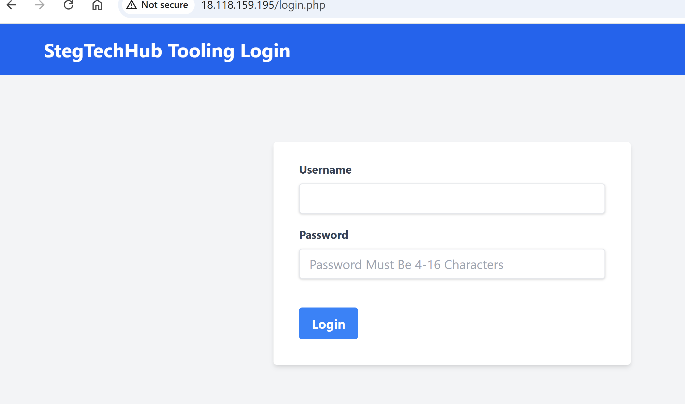

Log in with the created user.

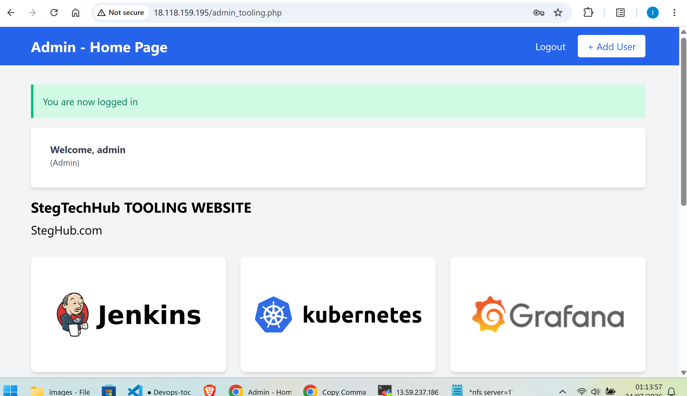

Confirmed logs were generated on the mounted log folder form server two.

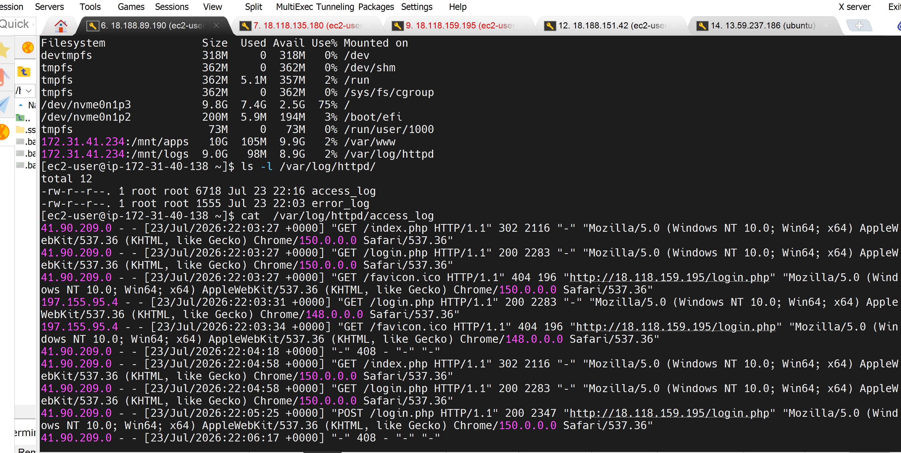
---

# Troubleshooting

## 403 Forbidden

Check ownership and permissions.

```bash
sudo chmod -R 755 /var/www/html

sudo chown -R root:root /var/www/html
```

---

## SELinux Issues

Temporarily disable SELinux.

```bash
sudo setenforce 0
```

To disable permanently:

```bash
sudo vi /etc/selinux/config
```

Change:

```text
SELINUX=enforcing
```

to

```text
SELINUX=disabled
```

Reboot the server afterward.


# Expected Result

After completing this deployment:

- All web servers serve the same PHP application.
- Application files are centrally stored on the NFS server.
- Apache logs are stored on shared NFS storage.
- All web servers connect to a single MySQL database.
- The infrastructure is scalable, making it easy to add additional web servers without duplicating application files.

---

# Technologies Used

- AWS EC2
- Amazon EBS
- Red Hat Enterprise Linux 8
- Ubuntu Server 24.04
- NFS
- Apache HTTP Server
- PHP
- MySQL
- Git
- GitHub
- Linux LVM (Physical Volumes, Volume Groups, Logical Volumes)