## 1. Overview

The project extends the previous web application architecture by
introducing a **software Layer 7 (L7) load balancer** in front of two
web servers.

The supplied architecture uses:

-   **Client** --- sends HTTP requests.
-   **Apache Load Balancer** --- receives client traffic and distributes
    it to the web servers.
-   **Web Server 1**
-   **Web Server 2**
-   **MySQL Database Server**
-   **NFS Server** --- provides shared storage for the web servers.

The document gives **Apache HTTP Server** as the load-balancing
technology.

### Architecture

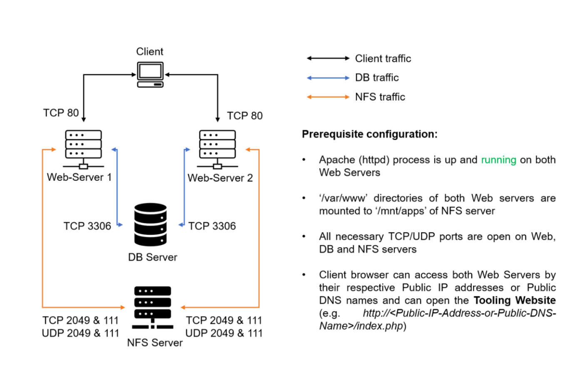

### Traffic flow

``` text
Client
  |
  | HTTP
  v
Apache Load Balancer
  |
  +---------> Web Server 1
  |
  +---------> Web Server 2
              |
              +----> MySQL Database
              |
              +----> NFS Shared Storage
```

The architecture separates the **client-facing entry point** from the
backend web servers. The load balancer decides which backend receives
each request.

------------------------------------------------------------------------

## 2. Prerequisites

Before configuring the load balancer configure below servers.

### Required servers

1.  Two RHEL 8 web servers
2.  One MySQL database server on Ubuntu 20.04 
3.  One RHEL 8 NFS server
4.  One additional Ubuntu EC2 instance to act as the Apache load
    balancer


### Prerequisite architecture

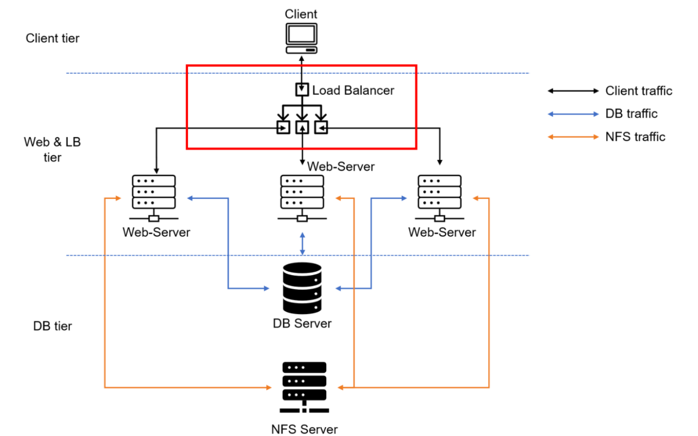

Ensure  that:

-   Apache HTTPD should be installed and running on both web servers.
-   The `/var/www` directory on both web servers should be mounted to
    `/mnt/apps` on the NFS server.
-   Required TCP/UDP ports should be open between the appropriate
    servers.
-   The web servers should be reachable through HTTP.
-   MySQL should be reachable by the web servers on TCP 3306.
-   NFS traffic should be allowed between the web servers and NFS
    server.

------------------------------------------------------------------------

# 3. Configure Apache as a Load Balancer

## 3.1 Create the Load Balancer EC2 Instance

 Creates an **Ubuntu 20.04 EC2 instance** and
names it:

``` text
Project-8-apache-lb
```

The load balancer will be the public-facing entry point for the
application.


### Security Group

Open **TCP port 80** on the load balancer security group.

The expected traffic path is:

``` text
Client ---> TCP/80 ---> Apache Load Balancer
```
The load balancer then forwards requests to the backend web servers.


------------------------------------------------------------------------

# 4. Install Apache and Required Modules

On the Project-8-apache-lb server:

``` bash
# Install Apache
sudo apt update
sudo apt install apache2 -y
```
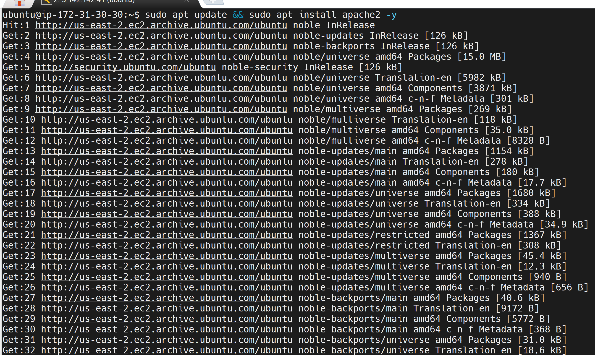

# Install development package used by the Apache module configuration
```bash
sudo apt-get install libxml2-dev
```
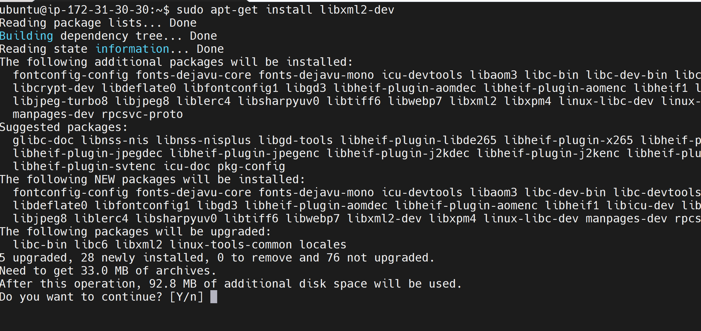

# Enable required Apache modules
```bash
sudo a2enmod rewrite
sudo a2enmod proxy
sudo a2enmod proxy_balancer
sudo a2enmod proxy_http
sudo a2enmod headers
sudo a2enmod lbmethod_bytraffic
```


# Restart Apache
```bash
sudo systemctl restart apache2
```

### Verify Apache

``` bash
sudo systemctl status apache2
```
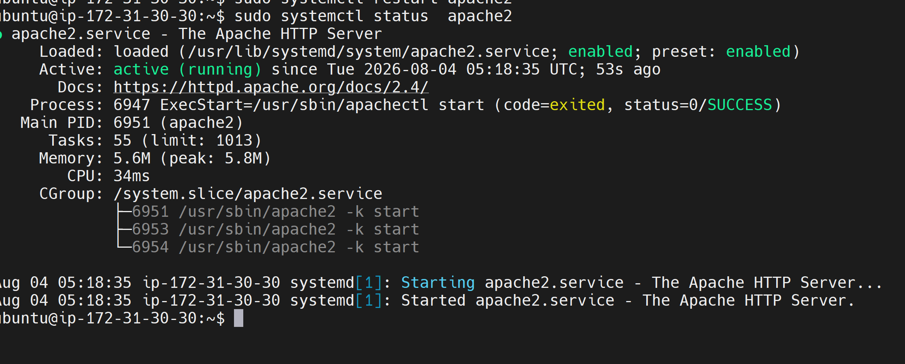


### What the modules do

  -----------------------------------------------------------------------
  Module                              Purpose
  ----------------------------------- -----------------------------------
  `rewrite`                           Enables Apache URL/request
                                      rewriting

  `proxy`                             Provides Apache reverse-proxy
                                      functionality

  `proxy_balancer`                    Provides Apache load-balancing
                                      functionality

  `proxy_http`                        Allows Apache to proxy HTTP
                                      requests

  `headers`                           Allows manipulation of HTTP headers

  `lbmethod_bytraffic`                Enables traffic-based
                                      load-balancing decisions
  -----------------------------------------------------------------------

### Self-study note

The important concept here is that Apache is acting as a **reverse
proxy** as well as a load balancer.

The client does not need to know which backend web server handles the
request:

``` text
Client
   |
   v
Apache LB
   |
   +--> Web1
   |
   +--> Web2
```

This hides the backend servers behind a single entry point.

------------------------------------------------------------------------

# 5. Configure Apache Load Balancing

Edit the Apache virtual-host configuration:

``` bash
sudo vi /etc/apache2/sites-available/000-default.conf
```
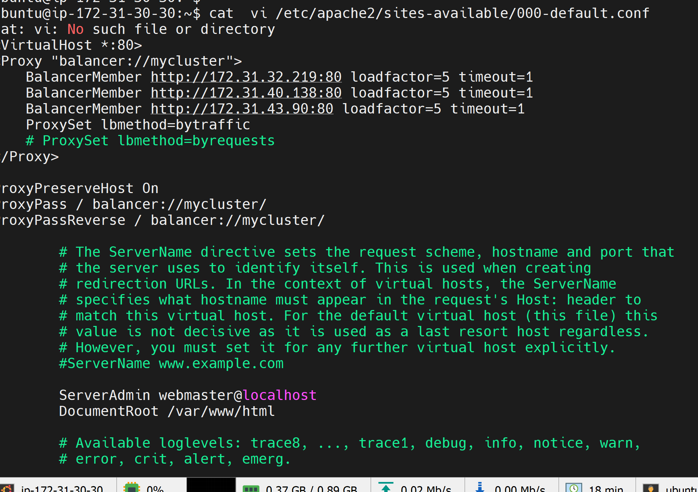

Add the following configuration inside the appropriate virtual-host
section:

``` bash
<Proxy "balancer://mycluster">
    BalancerMember http://<WebServer1-Private-IP-Address>:80 loadfactor=1 timeout=1
    BalancerMember http://<WebServer2-Private-IP-Address>:80 loadfactor=1 timeout=1

    ProxySet lbmethod=bytraffic
    # ProxySet lbmethod=byrequests
</Proxy>

ProxyPreserveHost On
ProxyPass / balancer://mycluster/
ProxyPassReverse / balancer://mycluster/
```

Then restart Apache:

``` bash
sudo systemctl restart apache2
```

------------------------------------------------------------------------

# 6. Understand the Configuration

## 6.1 `<Proxy "balancer://mycluster">`

``` apache
<Proxy "balancer://mycluster">
```

This creates an Apache **balancer cluster** named:

``` text
mycluster
```

Backend servers are then added as members of this cluster.

------------------------------------------------------------------------

## 6.2 BalancerMember

Example:

``` bash
BalancerMember http://<WebServer1-Private-IP-Address>:80 loadfactor=5 timeout=1
BalancerMember http://<WebServer2-Private-IP-Address>:80 loadfactor=5 timeout=1
```

Each `BalancerMember` represents a backend web server.

### `loadfactor`

The supplied configuration uses:

``` bash
loadfactor=5
```

A load factor influences how much traffic Apache assigns to a backend
relative to other members.

For example, if two servers have equal settings:

``` bash
Web1: loadfactor=5
Web2: loadfactor=5
```

they have equal configured weight.

If you later use:

``` bash
Web1: loadfactor=5
Web2: loadfactor=1
```

Web1 is configured to receive a greater share of traffic under
compatible load-balancing methods.

> **Note** A lower load factor does not automatically mean the
> server is unhealthy or has less CPU/RAM. It is a **configured
> weighting factor**. The actual effect depends on the selected
> balancing method and current traffic.

------------------------------------------------------------------------

## 6.3 `timeout=1`

``` bash
timeout=1
```

This specifies a short timeout value for the backend member.

> **Note** A very short timeout can be useful for quick failure
> detection in a lab, but in production it should be chosen carefully. A
> backend that is temporarily slow could otherwise be treated as
> unavailable.

------------------------------------------------------------------------

# 7. Load-Balancing Methods
``` bash
ProxySet lbmethod=bytraffic
# ProxySet lbmethod=byrequests
```

## 7.1 `bytraffic`

``` bash
ProxySet lbmethod=bytraffic
```

**Conceptually:**

``` text
             Apache LB
                 |
        +--------+--------+
        |                 |
      Web 1             Web 2
```
Apache considers the traffic load when making distribution decisions.
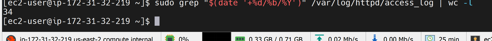
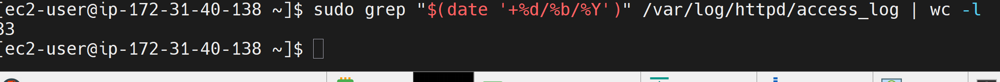

### Note
This is different from simply saying:
> "Send request 1 to Web1, request 2 to Web2."

Traffic-based balancing considers the amount of data/traffic associated
with backend members.
This can be useful when requests or responses vary significantly in
size.

------------------------------------------------------------------------

## 7.2 `byrequests`
``` bash
ProxySet lbmethod=byrequests
```
This method is based on the number of requests handled by the workers.
A simplified example:
``` text
Request 1 ---> Web1
Request 2 ---> Web2
Request 3 ---> Web1
Request 4 ---> Web2
```
------------------------------------------------------------------------

## 7.3 Other methods
-   `bybusyness`
-   `byrequests`
-   `heartbeat`
------------------------------------------------------------------------

# 8. Proxy Directives
``` apache
ProxyPreserveHost On
ProxyPass / balancer://mycluster/
ProxyPassReverse / balancer://mycluster/
```

## `ProxyPreserveHost`

``` apache
ProxyPreserveHost On
```

This tells Apache to preserve the original `Host` header when forwarding
the request.

This can matter when the backend application uses the hostname to
determine how to respond.

------------------------------------------------------------------------

## `ProxyPass`

``` apache
ProxyPass / balancer://mycluster/
```

This tells Apache to forward requests arriving at `/` to the configured
balancer cluster.

**Conceptually:**

``` text
http://LB/
     |
     v
balancer://mycluster/
     |
     +----> Web1
     |
     +----> Web2
```

------------------------------------------------------------------------

## `ProxyPassReverse`

``` apache
ProxyPassReverse / balancer://mycluster/
```
This helps Apache correctly handle redirect-related response headers
returned by the backend servers.

------------------------------------------------------------------------

# 9. Verify the Load Balancer

Access the load balancer using
its:

-   Public IP address, or
-   Public DNS name.

Example:

``` text
http://<Load-Balancer-Public-IP-or-Public-DNS-Name>/index.php
```


------------------------------------------------------------------------

# 10. Monitor Backend Web Server Logs

Open SSH/terminal sessions on **both web servers**.
``` bash
sudo tail -f /var/log/httpd/access_log
```

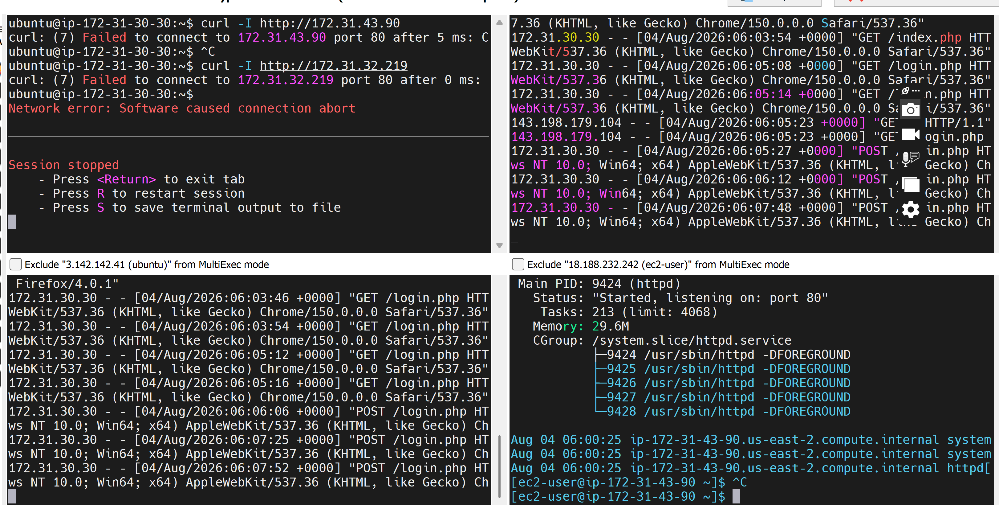

This continuously displays new Apache access-log entries.
Observe the logs on both web servers.

### What you are looking for

You want to confirm that requests entering through:

``` text
Client
   |
   v
Load Balancer
```

are being forwarded to:

``` text
Web Server 1
```

and:

``` text
Web Server 2
```

rather than all requests being sent to only one backend.
``` bash
sudo tail -f /var/log/apache2/access.log
```

For the RHEL web servers, if Apache HTTPD is configured with the
standard log location:

``` bash
sudo tail -f /var/log/httpd/access_log
```

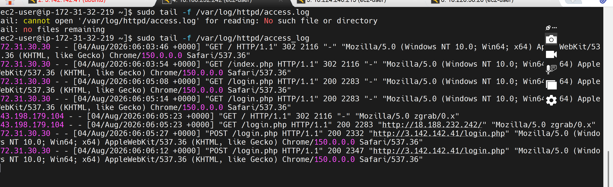


------------------------------------------------------------------------

# 11. Optional Step --- Local DNS Name Resolution

The document provides an optional approach for avoiding the need to
remember private IP addresses.

Edit:

``` bash
sudo vi /etc/hosts
```

Add entries similar to:

``` text
<WebServer1-Private-IP-Address> Web1
<WebServer2-Private-IP-Address> Web2
```

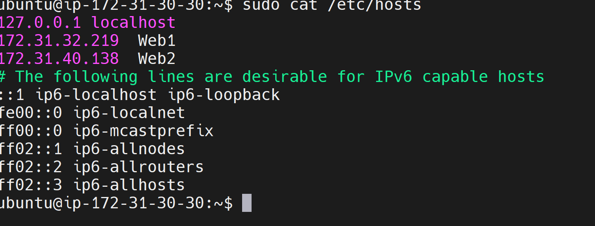

You can then configure the load balancer using:

``` apache
BalancerMember http://Web1:80 loadfactor=5 timeout=1
BalancerMember http://Web2:80 loadfactor=5 timeout=1
```


------------------------------------------------------------------------

# 12. Test the Local Names

From the load balancer:

``` bash
curl http://Web1
```

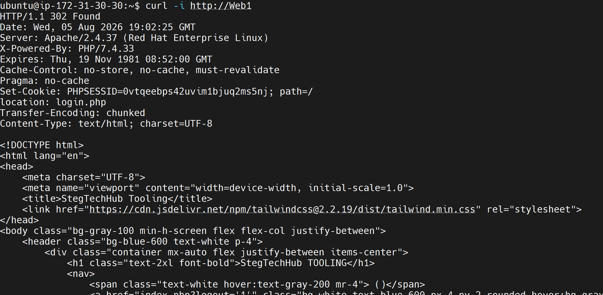
and:

``` bash
curl http://Web2
```

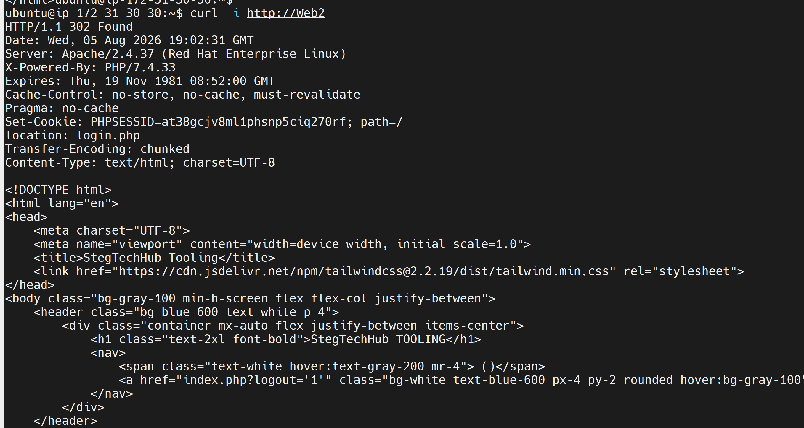

The expected behavior is that the names resolve locally on the load
balancer.Will only resolve on systems where the corresponding `/etc/hosts`
entries have been configured.

These names are not automatically:
-   Internet DNS names
-   VPC-wide DNS records
-   Globally resolvable hostnames

**Key Takeaway**

The major infrastructure concept from this module is learning how to distribute application traffic across multiple servers using Apache as a Layer 7 reverse proxy/load balancer, and how to validate that traffic distribution through configuration testing, traffic generation, and server logs.
# Technologies Used

- AWS EC2
- Amazon EBS
- Red Hat Enterprise Linux 8
- Ubuntu Server 24.04
- NFS
- Apache HTTP Server
- PHP
- MySQL
- Git
- GitHub
- Linux LVM (Physical Volumes, Volume Groups, Logical Volumes)